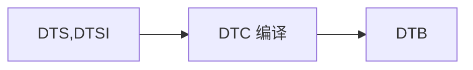

#### 1、相关概念

1. DTC：device tree compiler，编译工具，可以将.dts文件编译成.dtb文件
2. DTS：device tree source，设备树源码，有两种文件：**.dts**、**.dtsi**
   * **.dts**文件是一种ASCII文本对Device Tree的描述，放置在内核的/arch/arm/boot/dts目录。一般而言，一个*.dts文件对应一个ARM的machine
   * 由于一个SOC可能有多个不同的电路板，而每个电路板拥有一个**.dts**。这些**dts**势必会存在许多共同部分，为了减少代码的冗余，设备树将这些共同部分提炼保存在***.dtsi**文件中，供不同的**dts**共同使用。**.dtsi**的使用方法，类似于C语言的头文件，在dts文件中需要进行include**.dtsi**文件。当然，dtsi本身也支持include 另一个dtsi文件。
3. DTB：device tree blob，dts生成的二进制文件

#### 2、反汇编dtb

* 使用fdtdump工具进行反汇编：fdtdump **.dtb > temp.dts

  > fdtdump u-boot.dtb  > dt.dts

* 使用dtc编译器进行反汇编

#### 3、DTS格式

device tree的基本单元是node。这些node被组织成树状结构，除了root node，每个node都只有一个parent。
一个device tree文件中只能有一个root node。每个node中包含了若干的property/value来描述该node的一些特性。

* 节点名字的格式是node-name@unit-address。如果该node没有reg属性（后面会描述这个property），
  那么该节点名字中必须不能包括@和unit-address。unit-address的具体格式是和设备挂在那个bus上相关

  > 例如对于cpu，其unit-address就是从0开始编址，以此加一。而具体的设备，例如以太网控制器，其unit-address就是寄存器地址

* 每个设备，都有一个compatible属性，compatible属性用于驱动和设备的绑定。

> 在一个树状结构的device tree中，如何引用一个node呢？要想唯一指定一个node必须使用full path，例如/node-name-1/node-name-2/node-name-N。 