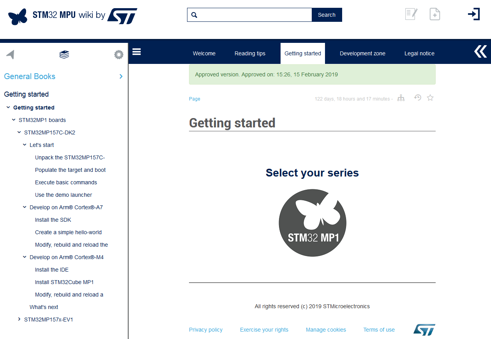

## [Getting started](https://wiki.st.com/stm32mpu/wiki/Getting_star)

这部分主要讲3部分：
* Let's start
    * 介绍ST官方开发板开箱、说需要的配件：[Unpack the STM32MP157C-DK2 board](https://wiki.st.com/stm32mpu/wiki/Getting_started/STM32MP1_boards/STM32MP157C-DK2/Let%27s_start/Unpack_the_STM32MP157C-DK2_board)、[Unpack the STM32MP157x-EV1 board](https://wiki.st.com/stm32mpu/wiki/Getting_started/STM32MP1_boards/STM32MP157x-EV1/Let%27s_start/Unpack_the_STM32MP157x-EV1_board)
    * 介绍了烧录工具、下载固件并烧录、开机：[Populate the target and boot the image-DK](https://wiki.st.com/stm32mpu/wiki/Getting_started/STM32MP1_boards/STM32MP157C-DK2/Let%27s_start/Populate_the_target_and_boot_the_image)，[Populate the target and boot the image-EV](https://wiki.st.com/stm32mpu/wiki/Getting_started/STM32MP1_boards/STM32MP157x-EV1/Let%27s_start/Populate_the_target_and_boot_the_image)
    * 介绍Linux PC中登录STM32MPU，及在STM32MPU中一些基本的Linux命令：[xecute basic commands-DK](https://wiki.st.com/stm32mpu/wiki/Getting_started/STM32MP1_boards/STM32MP157C-DK2/Let%27s_start/Execute_basic_commands)、[Execute basic commands-EV](https://wiki.st.com/stm32mpu/wiki/Getting_started/STM32MP1_boards/STM32MP157x-EV1/Let%27s_start/Execute_basic_commands)
    * 介绍一些示例程序：[Use the demo launcher-DK2](hhttps://wiki.st.com/stm32mpu/wiki/Getting_started/STM32MP1_boards/STM32MP157C-DK2/Let%27s_start/Use_the_demo_launcher)[Use the demo launcher-EV1](https://wiki.st.com/stm32mpu/wiki/Getting_started/STM32MP1_boards/STM32MP157x-EV1/Let%27s_start/Use_the_demo_launcher)

* Develop on Arm® Cortex®-A7
    * 安装SDK-安装交叉编译工具及一些库：[Install the SDK-EV1](https://wiki.st.com/stm32mpu/wiki/Getting_started/STM32MP1_boards/STM32MP157x-EV1/Develop_on_Arm%C2%AE_Cortex%C2%AE-A7/Install_the_SDK)、[Install the SDK-DK2](https://wiki.st.com/stm32mpu/wiki/Getting_started/STM32MP1_boards/STM32MP157C-DK2/Develop_on_Arm%C2%AE_Cortex%C2%AE-A7/Install_the_SDK)
  
    * 创建一个简单的Hello World应用程序：创建一个简单的GTK程序：[Create a simple hello-world application-DK2](https://wiki.st.com/stm32mpu/wiki/Getting_started/STM32MP1_boards/STM32MP157C-DK2/Develop_on_Arm%C2%AE_Cortex%C2%AE-A7/Create_a_simple_hello-world_application)、[Create a simple hello-world application-EV1](https://wiki.st.com/stm32mpu/wiki/Getting_started/STM32MP1_boards/STM32MP157x-EV1/Develop_on_Arm%C2%AE_Cortex%C2%AE-A7/Create_a_simple_hello-world_application)
    * 修改、编译、更新内核：[Modify, rebuild and reload the Linux® kernel-DK2](https://wiki.st.com/stm32mpu/wiki/Getting_started/STM32MP1_boards/STM32MP157C-DK2/Develop_on_Arm%C2%AE_Cortex%C2%AE-A7/Modify,_rebuild_and_reload_the_Linux%C2%AE_kernel)、[Modify, rebuild and reload the Linux® kernel-EV1](https://wiki.st.com/stm32mpu/wiki/Getting_started/STM32MP1_boards/STM32MP157x-EV1/Develop_on_Arm%C2%AE_Cortex%C2%AE-A7/Modify,_rebuild_and_reload_the_Linux%C2%AE_kernel)

* Develop on Arm® Cortex®-M4
    * 安装IDE：[STM32MP157C-DK2](https://wiki.st.com/stm32mpu/wiki/Getting_started/STM32MP1_boards/STM32MP157C-DK2/Develop_on_Arm%C2%AE_Cortex%C2%AE-M4/Install_the_IDE)[STM32MP157x-EV1](https://wiki.st.com/stm32mpu/wiki/Getting_started/STM32MP1_boards/STM32MP157x-EV1/Develop_on_Arm%C2%AE_Cortex%C2%AE-M4/Install_the_IDE)
    * Install STM32Cube MP1 package：[STM32MP157C-DK2](https://wiki.st.com/stm32mpu/wiki/Getting_started/STM32MP1_boards/STM32MP157C-DK2/Develop_on_Arm%C2%AE_Cortex%C2%AE-M4/Install_STM32Cube_MP1_package)、[STM32MP157x-EV1](https://wiki.st.com/stm32mpu/wiki/Getting_started/STM32MP1_boards/STM32MP157x-EV1/Develop_on_Arm%C2%AE_Cortex%C2%AE-M4/Install_STM32Cube_MP1_package)
    * Modify, rebuild and reload a firmware：[STM32MP157C-DK2](https://wiki.st.com/stm32mpu/wiki/Getting_started/STM32MP1_boards/STM32MP157C-DK2/Develop_on_Arm%C2%AE_Cortex%C2%AE-M4/Modify,_rebuild_and_reload_a_firmware)、[STM32MP157x-EV1](https://wiki.st.com/stm32mpu/wiki/Getting_started/STM32MP1_boards/STM32MP157x-EV1/Develop_on_Arm%C2%AE_Cortex%C2%AE-M4/Modify,_rebuild_and_reload_a_firmware)

[STM32MP15 Discovery kits - Starter Package](https://wiki.st.com/stm32mpu/wiki/STM32MP15_Discovery_kits_-_Starter_Package)

[STM32MP157X-DKX - hardware description](https://wiki.st.com/stm32mpu/wiki/STM32MP157X-DKX_-_hardware_description)

STM32MP15 Discovery kits 硬件介绍:[MB1272](https://wiki.st.com/stm32mpu/wiki/MB1272)
<!-- 

 -->

## [STM32MP1 Developer Package](https://wiki.st.com/stm32mpu/wiki/STM32MP1_Developer_Package)
* Installing the components to develop software running on Arm Cortex-A
    *    Installing the SDK
    *     Installing the Linux kernel
    *      Installing the U-Boot
    *       Installing the TF-A
    *  Installing the OP-TEE
    *   Installing the debug symbol files
*  Installing the components to develop software running on Arm Cortex-M4 (STM32Cube MPU Package)
    *  Installing the Eclipse IDE
    *  Installing the STM32Cube MPU Package
* Developing software running on Arm Cortex-A7
    * Modifying the Linux kernel
    * Adding external out-of-tree Linux kernel modules
    * Adding Linux user space applications
    * Modifying the U-Boot
    *  Modifying the TF-A
    *   Modifying the OP-TEE
*  Developing software running on Arm Cortex-M4

## [STM32MP1 Distribution Package](https://wiki.st.com/stm32mpu/wiki/STM32MP1_Distribution_Package)
Yocto Project