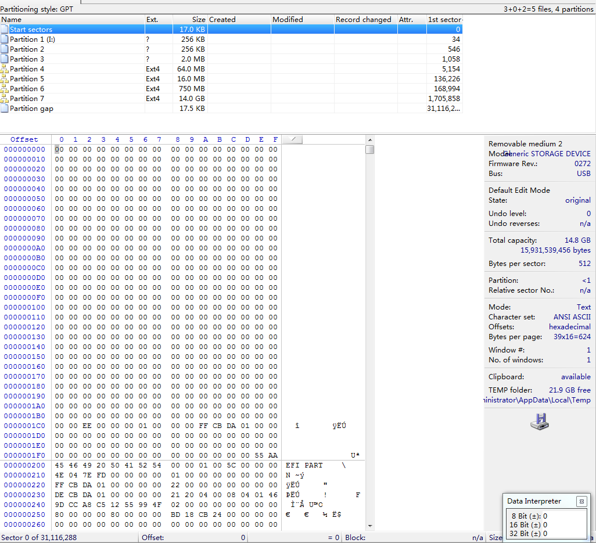
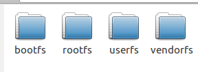
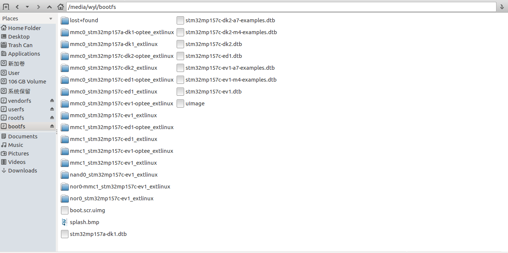
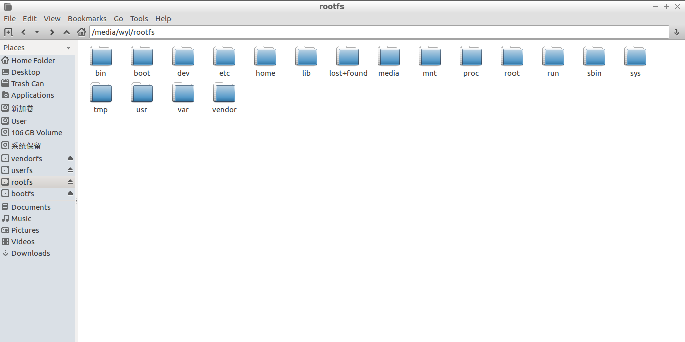
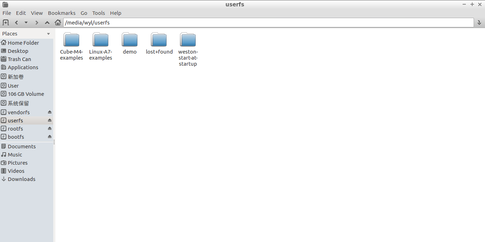

把烧录了固件的SD卡插到Win7，虽然不能通过文件管理器打开查看SD卡，还是可以用WinHex打开，打开后如下：

把有固件的SD卡用读卡器接到Linux PC，会有4个磁盘，如下：

正好与win7中用winHex打开，看到的4个Ext4格式的分区对应，

4个分区中的文件为：

* ##### bootfs

  

* ###### rootfs

  

* ##### userfs

  

* vendorfs

  

从SD卡启动的原理（猜想）：

1. bootrom 从SD读取二进制数据的FSBL，没有文件系统，
2. FSBL再从SD卡读取SSBL，也是没有文件系统
3. FSBL是在DRAM跑的，可是实现比较复杂的应用，所以可以支持文件系统，所以FSBL从SD卡中的分区表读取其他的启动信息根内核，启动内核

那怎么从SD卡中定位FSBL、SSBL？