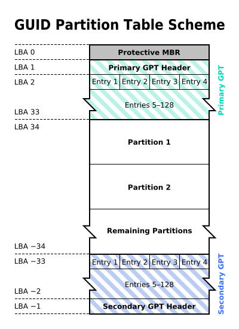
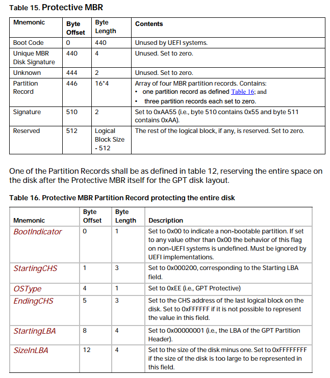
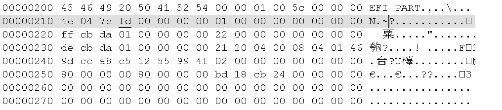
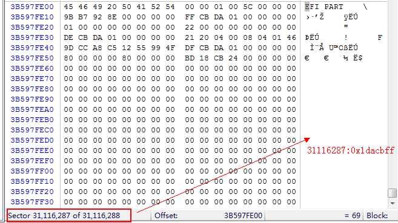
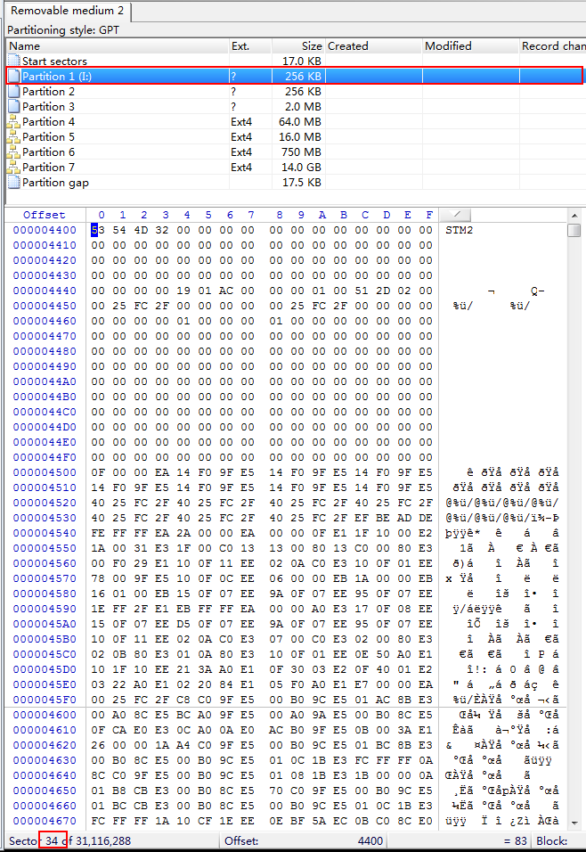
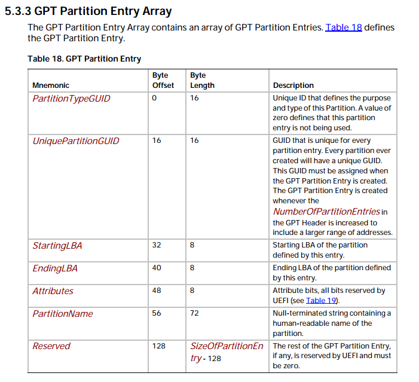
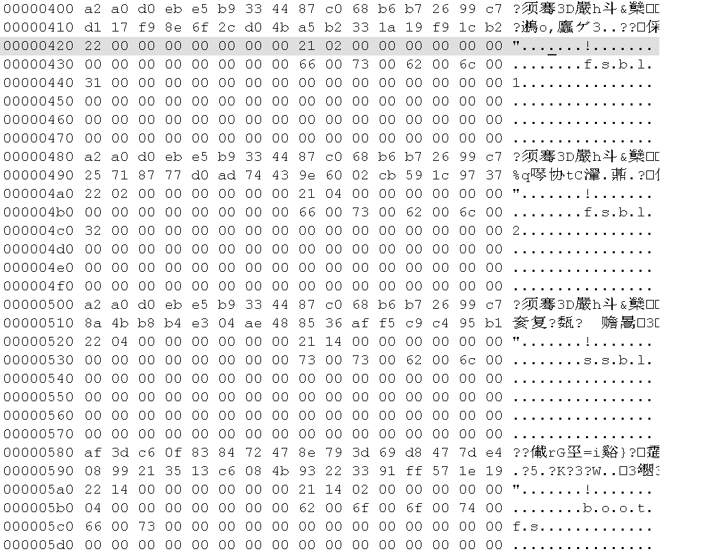

把烧录了固件的SD卡插到Win7，虽然不能通过文件管理器打开查看SD卡，还是可以用WinHex打开，打开后如下：


把有固件的SD卡用读卡器接到Linux PC，会有4个磁盘，如下：


正好与win7中用winHex打开，看到的4个Ext4格式的分区对应，

4个分区中的文件为：

* ##### bootfs

  

* ###### rootfs

  

* ##### userfs

  

* vendorfs

  


```
从SD卡启动的原理（猜想）：

1. bootrom 从SD读取二进制数据的FSBL，没有文件系统，
2. FSBL再从SD卡读取SSBL，也是没有文件系统
3. FSBL是在DRAM跑的，可是实现比较复杂的应用，所以可以支持文件系统，所以FSBL从SD卡中的分区表读取其他的启动信息根内核，启动内核

那怎么从SD卡中定位FSBL、SSBL？
```

这个跟磁盘分区有关，这里用的是GPT分区，在SD卡的前几个分区有SD卡的分区信息，从这些信息可以知道哪些信息存放在哪里，GPT分区结构如下：



#### LBA 0

保护性**MBR**(Protective **MBR**)，在磁盘的第一个扇区（LBA 0），Protective MBR 的数据格式如下：

​	

```
00 
00 00 00 
ee 
00 00 00 
01 00 00 00 
ff cb da 01 
```

0xee值标注了该分区为GPT分区

#### LBA 1

GPT头，下图是STM32MPU1 SD卡中的LBA 1中的数据：



* 前8字节是签名（Signature），**EFI PART**（0x5452415020494645），

* 4字节的版本号：0x00010000

* 4自己的GPT header大小：0x0000005c，92字节，

* 4字节的HeaderCRC32

* 4字节保留，为0x00

* 8字节地址，当前数据所在的LBA

* 8字节地址，GPT Header备份所在LBA，这里是0x1dacbff，下图是WinHex中的第0x1dacbff扇区的数据：

  

* 8字节地址，第一个分区所在地址，0x00000000 00000022，十进制是34，在WinHex中跳转到34扇区，结果如下：正好是Partition 1所在的位置，

  

* 8字节地址，最后一个分区所在地址：0x00000000 01dacbde

* 16字节，磁盘的GUID，即唯一标识符

* GPT入口，即开始所在的LBA

* 4字节：0x00 00 00 80 = 128，分区表总项数，通常限定为“80 00 00 00”(0x80)，也就是128个。

* 4字节，每个分区表项占用字节数，通常限定为“80 00 00 00”(0x80)，也就是128字节。

* 4字节，PartitionEntryArrayCRC32，分区表CRC校验和

  


为了减少分区表损坏的风险，GPT在硬盘最后保存了一份分区表的副本。(GPT数据结构在磁盘上存储两次：开始和结束各一次。)

#### 3  分区表项

* #### 分区表的格式

分区表的格式如下：



* 第一个是分区类型GUID，16字节
* 第二个是分区GUID，16字节
* 第三个是起始LBA，8字节，
* 第四个是末尾LBA，8字节，
* 第五个是属性，
* 第六部分是分区名


* #### STM32MPU中的分区表项

  

  * 第一部分：

    * 分区类型GUID，原始数据是：

      > a2 a0 d0 eb e5 b9 33 44 87 c0 68 b6 b7 26 99 c7

      由于这里是小端格式，读出来的数据应该是：

      >  EBD0A0A2-B9E5-4433-87C0-68B6B72699C7

      数据分区

    * 分区GUID

    * 起始LBA

    * 末尾LBA

    * 属性

    * 分区名：fsbl1

  * 第四部分：

    * 分区类型GUID，原始数据是：

    > 0FC63DAF-8483-4772-8E79-3D69D8477DE4

    数据分区。Linux曾经使用和Windows基本数据分区相同的GUID。
    这个新的GUID是由 GPT fdisk 和 GNU Parted 开发者根据Linux传统的"8300"分区代码发明的。

    

    

参考：

* [全局唯一标识分区表](https://baike.baidu.com/item/%E5%85%A8%E5%B1%80%E5%94%AF%E4%B8%80%E6%A0%87%E8%AF%86%E5%88%86%E5%8C%BA%E8%A1%A8/1956466)

* **Unified Extensible Firmware Interface Specification** 


##### PS

这里用的是16GB的SD卡