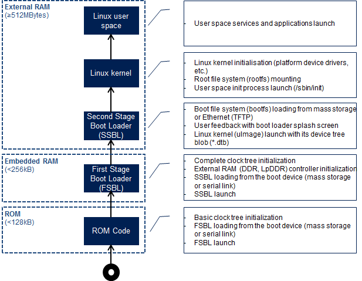

## STM32MPU Embedded Software
1. 运行在Arm Cortex-A中的OpenSTLinux
* OpenSTLinux BSP
  * boot chains base on TF-A and u-boot
  * OP-TEE secur OS 
  * Linux 
* application frameworks 
  * Trusted Applications  in OP-TEE
  * Applications  on Linux
2. 运行在Arm Cortex-M STM32Cube MPU Package

## Boot

### [Boot chains overview](https://wiki.st.com/stm32mpu/wiki/Boot_chains_overview)
* Generic boot sequence
1. Linux start-up
     ROM code ->  First stage boot loader (FSBL) -> Second-stage boot loader (SSBL) -> Linux kernel space -> Linux user space

     

2. STM32MP boot sequence

### [Platform boot](https://wiki.st.com/stm32mpu/wiki/Category:Platform_boot)
1. [STM32MP15 ROM code overview](https://wiki.st.com/stm32mpu/wiki/STM32MP15_ROM_code_overview)
CPU上电（复位）后运行的第一段代码，

[get uboot](https://wiki.st.com/stm32mpu/wiki/STM32MP1_Developer_Package#Checking_the_prerequisites)

[Modifying_the_U-Boot](https://wiki.st.com/stm32mpu/wiki/How_to_cross-compile_with_the_Developer_Package#Modifying_the_U-Boot)

参考：

[U-Boot overview](https://wiki.st.com/stm32mpu/wiki/U-Boot_overview)

