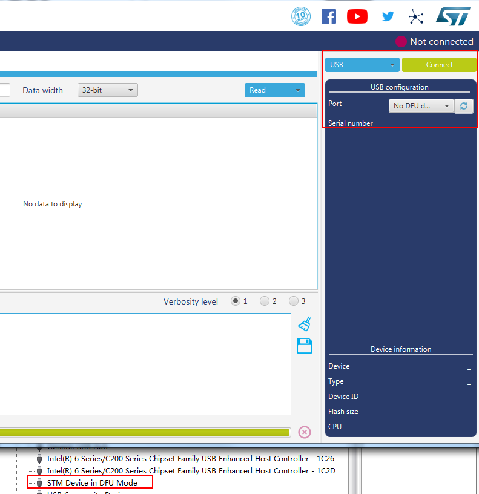
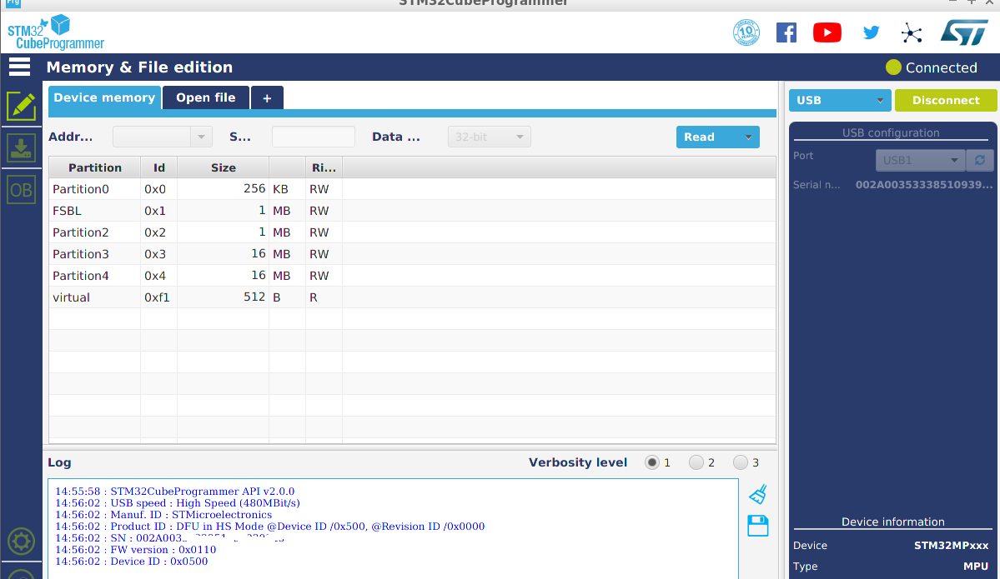

环境：

1.  一台PC

2. [STM32CubeProgrammer](https://www.st.com/en/development-tools/stm32cubeprog.html)

   我下载到的是2.1版本（19\07\10下载的）

   

里面的文件是：


里面有3个文件，分别window、Linux、Mac下的，也就是说这个软件支持3个系统


3. 安装

   window下直接双击即可，

   Linux下，需要在命令行中执行：

   > ```
   > ./SetupSTM32CubeProgrammer-2.0.0.linux
   > ```

   然后把安装目录添加到环境变量

4. 使用

   * window下，

     我的电脑是window7 64bit，

     

   用STM32CubeProgrammer无法搜到DFU设备，可是我的电脑是由DFU设备的：

   

使用命令行的话，也找不到设备：

​	


* Linux 下：

  把设备插到电脑上，用**lsusb**查看USB设备：

  

  使用命令行打开：

  > halin@halin-PC:~/STMicroelectronics/STM32Cube/STM32CubeProgrammer/bin$ sudo ./STM32CubeProgrammer

由于我没有把安装目录添加到环境变量，我直接到安装目录运行，而且必须加上**sudo**,不然会找不到设备，打开后如下：



可以搜到并且连接到设备


* 下载

  * 打开**tsv**文件

    

  * 打开Image文件夹

    

  * 然后下载，下载成功后如下：

    


​			烧录过成功，如果DK2接了LCD，LCD会显示一些文字信息：

​			

​			uart4(debug 口)也有输出一些信息：

​			


window 下安装驱动：

因为之前看到的信息是通过USB下载的话，STM32MP1X是处 于DFU mode，当我把DK2插入到windnow时，出现如下设备：


我以为就是对的，可是STM32CubeProgrammer无法连接该设备，后来认真看了下文档（[How to proceed when the DFU driver installation fails on Windows host PC](https://wiki.st.com/stm32mpu/wiki/STM32CubeProgrammer)），才知道需要另外的驱动，

首先把原来的驱动删了，然后到STM32CubeProgrammer的安装目录下的**Drivers\DFU_Driver**，我电脑是：

> C:\Program Files\STMicroelectronics\STM32Cube\STM32CubeProgrammer\Drivers\DFU_Driver

里面有个文件：**STM32Bootloader.bat**，双击打开就可以安装对应的驱动了，安装完后出现如下设备：


就可以在window下通过STM32CubeProgrammer给STM32MP15X下载固件了

参考：

[STM32CubeProgrammer software description ](https://www.st.com/content/ccc/resource/technical/document/user_manual/group0/76/3e/bd/0d/cf/4d/45/25/DM00403500/files/DM00403500.pdf/jcr:content/translations/en.DM00403500.pdf)