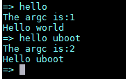

1.  code

   ```
   #include <common.h>
   #include <command.h>
   
   static int do_hello(cmd_tbl_t *cmdtp, int flag, int argc, char * const argv[])
   {
   	printf("The argc is:%d\r\n",argc);
   	if(argc ==1)
   		printf("Hello world\n");
   	else if(argc ==2)
   		printf("Hello %s\n",argv[1]);
   
   	return 0;
   }
   
   U_BOOT_CMD(
   	hello,	2,	1,	do_hello,
   	"print command description/usage",
   	"\n"
   	"the helloworld cmd,print hello XXXX\n"
   );
   ```

   

2. 修改**u-boot\cmd\Makefile**

3. 运行

   

   