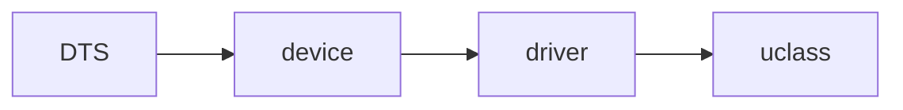

#### 分几个层面

1. 设备树相关
2. driver model相关


#### 整体构架

* udevice

  指设备对象

* driver

  udevice的驱动，可以理解为kernel中的device_driver。和底层硬件设备通信，并且为设备提供面向上层的接口。

* uclass

  uclass，使用相同方式的操作集的device的组，uclass为那些使用相同接口的设备提供了统一的接口

* uclass_driver

  对应uclass的驱动程序。主要提供uclass操作时，如绑定udevice时的一些操作


``````mermaid

graph TD

	A[Driver modle] -->B(Uclass)

    A[Driver modle] --> C(Driver)

    A[Driver modle] --> D(Device)
``````


```
struct driver {
	char *name;
	enum uclass_id id;
	const struct udevice_id *of_match;
	int (*bind)(struct udevice *dev);
	int (*probe)(struct udevice *dev);
	int (*remove)(struct udevice *dev);
	int (*unbind)(struct udevice *dev);
	int (*ofdata_to_platdata)(struct udevice *dev);
	int (*child_post_bind)(struct udevice *dev);
	int (*child_pre_probe)(struct udevice *dev);
	int (*child_post_remove)(struct udevice *dev);
	int priv_auto_alloc_size;
	int platdata_auto_alloc_size;
	int per_child_auto_alloc_size;
	int per_child_platdata_auto_alloc_size;
	const void *ops;	/* driver-specific operations */
	uint32_t flags;
};
```


```
struct uclass {
	void *priv;
	struct uclass_driver *uc_drv;
	struct list_head dev_head;
	struct list_head sibling_node;
};
```

```
struct udevice {
	const struct driver *driver;
	const char *name;
	void *platdata;
	void *parent_platdata;
	void *uclass_platdata;
	ofnode node;
	ulong driver_data;
	struct udevice *parent;
	void *priv;
	struct uclass *uclass;
	void *uclass_priv;
	void *parent_priv;
	struct list_head uclass_node;
	struct list_head child_head;
	struct list_head sibling_node;
	uint32_t flags;
	int req_seq;
	int seq;
#ifdef CONFIG_DEVRES
	struct list_head devres_head;
#endif
};
```


## derive modle demo

#### cmd demo

> u-boot\cmd\demo.c

该文件实现了一些用来测试driver model demo 的驱动的命令

#### driver demo:

> u-boot\drivers\demo\\*


### uclass

* **如何定义**

  uclass是uboot自动生成。并且不是所有uclass都会生成，有对应uclass driver并且有被udevice匹配到的uclass才会生成。 

* **存放位置** 

  所有生成的uclass都会被挂载gd->uclass_root链表上。

* **如何获取**

  直接遍历链表gd->uclass_root链表并且根据uclass id来获取到相应的uclass。


global_data中有这么几个：

```
struct udevice  *dm_root; 
struct udevice  *dm_root_f;
struct list_head uclass_root; 
```


首先会创建根设备，对应dts中的根节点，

其中uclass_root是一个链表，所有udevice匹配的uclass都会挂载到这个链表上


## NOTE

1、生成顺序

**<u>首先根据dts，创建设备(udevice)，然后根据dts中的变量，查找驱动(udriver)，然后根据驱动中的uclass_id创建uclass</u>**




1. 解析dtb，生成device

2. 匹配对应的driver

   > ​	It looks at the compatible string in each node and uses the of_match table of the U_BOOT_DRIVER() structure to find the right driver for each node.

   摘自：**uboot/doc/driver-model/README.txt**

```
For each device that is discovered, U-Boot then calls device_bind() to create a
new device, initializes various core fields of the device object such as name,
uclass & driver, initializes any optional fields of the device object that are
applicable such as of_offset, driver_data & platdata, and finally calls the
driver's bind() method if one is defined.
```


#### 生命周期


1. ##### Bind stage

   * discover device
   * create new device by calls device_bind()，initializes device's object(such as name、uclass、driver)、initializes optional fields of device's object(of_offset、driver_data、platdata)

2. ##### Activation/probe

   When a device needs to be used, U-Boot activates it，by following thest steps：

   *  priv_auto_alloc_size
   * platdata_auto_alloc_size

3. ##### Running stage

4. ##### Removal stage

5. ##### Unbind stage