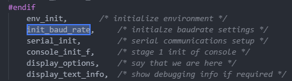
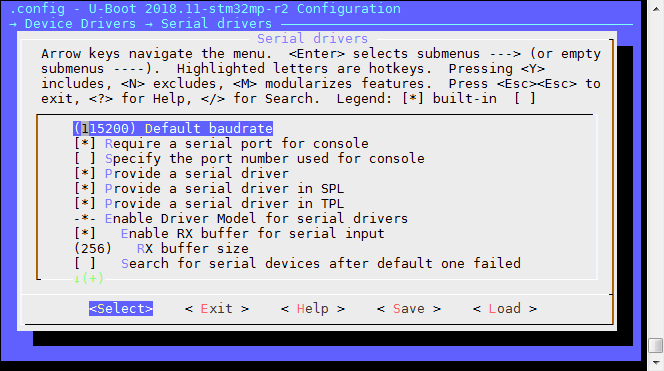

1、概述
uboot可以通过串口输出很多信息，
2、初始化位置
在文件**u-boot-2018.11\common\board_f.c**中有这么一个函数：
```
void board_init_f(ulong boot_flags)
{
	gd->flags = boot_flags;
	gd->have_console = 0;

	if (initcall_run_list(init_sequence_f))
		hang();

#if !defined(CONFIG_ARM) && !defined(CONFIG_SANDBOX) && \
		!defined(CONFIG_EFI_APP) && !CONFIG_IS_ENABLED(X86_64) && \
		!defined(CONFIG_ARC)
	/* NOTREACHED - jump_to_copy() does not return */
	hang();
#endif
}
```
上述函数中运行**init_sequence_f**中的一些列函数，当中有如下一些函数：




3、 init_baud_rate
该函数在**u-boot-2018.11\common\board_f.c**中：
```
static int init_baud_rate(void)
{
	gd->baudrate = env_get_ulong("baudrate", 10, CONFIG_BAUDRATE);
	return 0;
}
```
通过搜索，在文件**u-boot-2018.11\.config**中找到了**CONFIG_BAUDRATE**:
```
#
# Serial drivers
#
CONFIG_BAUDRATE=115200
CONFIG_REQUIRE_SERIAL_CONSOLE=y
# CONFIG_SPECIFY_CONSOLE_INDEX is not set
CONFIG_SERIAL_PRESENT=y
```
那波特率的值是不是就这个呢？这个还得看函数**env_get_ulong**实现什么功能，                
另外，uboot配置中（make menuconfig），也有波特率设置的选项：
```
    Device Drivers --->
        Serial drivers --->
```



4、serial_init

