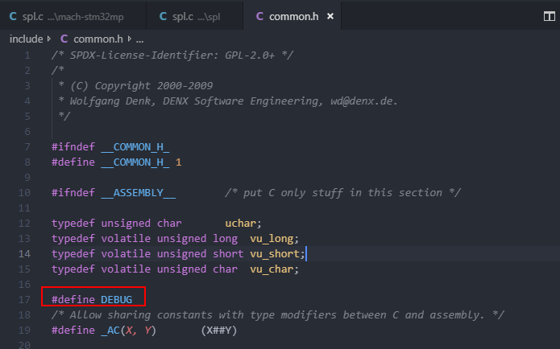

打开调试信息：

全局打开：

在文件**u-boot-2018.11\include\common.h**中添加：

> #define DEBUG

如下：

Logging Levels:

* LOGL_EMERG	- Printed before U-Boot halts

* LOGL_ALERT	- Indicates action must be taken immediate or U-Boot will crash
* LOGL_CRIT	- Indicates a critical error that will cause boot failure
* LOGL_ERR	- Indicates an error that may cause boot failure
* LOGL_WARNING	- Warning about an unexpected condition
* LOGL_NOTE	- Important information about progress
* LOGL_INFO	- Information about normal boot progress
* LOGL_DEBUG	- Debug information (useful for debugging a driver or subsystem)
* LOGL_DEBUG_CONTENT	- Debug message showing full message content
* LOGL_DEBUG_IO	- Debug message showing hardware I/O access

参考：

[README.log](https://github.com/u-boot/u-boot/blob/master/doc/README.log)