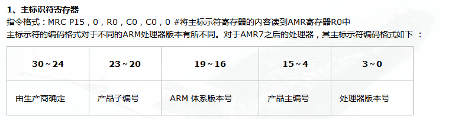
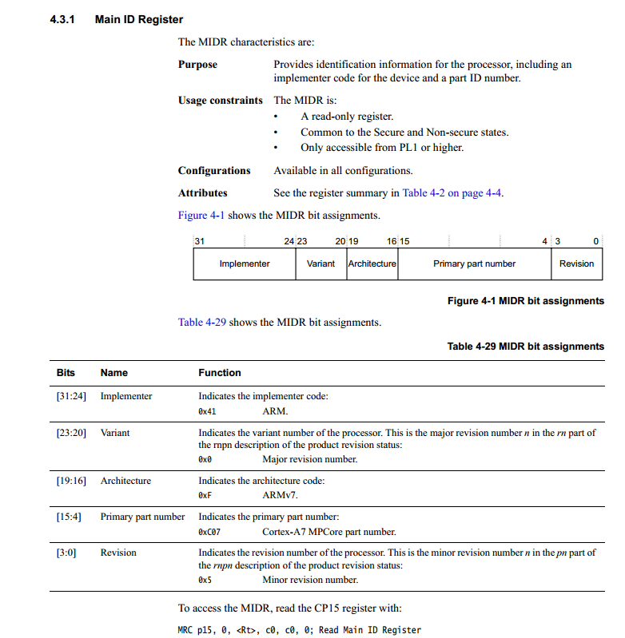
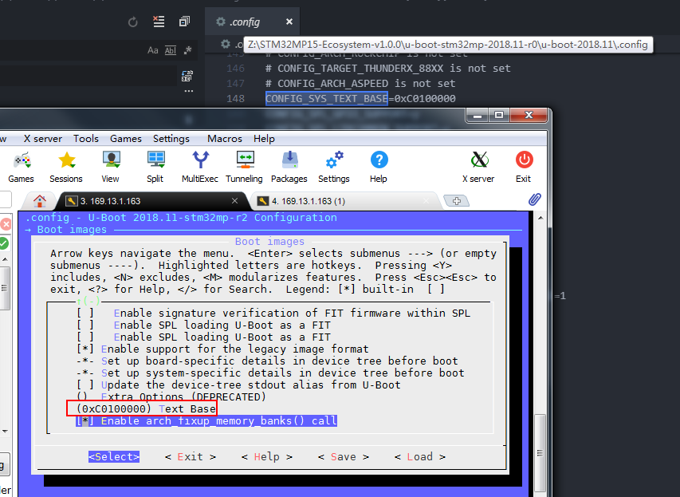

1.

```
	mrc	p15, 0, r0, c0, c1, 1		@ read ID_PFR1
	and	r0, r0, #CPUID_ARM_VIRT_MASK	@ mask virtualization bits
	cmp	r0, #(1 << CPUID_ARM_VIRT_SHIFT)
	beq	switch_to_hypervisor
```


```
#define CPUID_ARM_VIRT_SHIFT		12
#define CPUID_ARM_VIRT_MASK		(0xF << CPUID_ARM_VIRT_SHIFT)
```

这段代码应该是读取CP15 C0，判断支不支持虚拟化，





### lowlevel_inits.s 中：

```
	/*
	 * Setup a temporary stack. Global data is not available yet.
	 */
#if defined(CONFIG_SPL_BUILD) && defined(CONFIG_SPL_STACK)
	ldr	sp, =CONFIG_SPL_STACK
#else
	ldr	sp, =CONFIG_SYS_INIT_SP_ADDR
#endif
	bic	sp, sp, #7 /* 8-byte alignment for ABI compliance */
```


stm32mp1.h中

```
#define CONFIG_SPL_STACK		(STM32_SYSRAM_BASE + STM32_SYSRAM_SIZE)
```

stm32.h中

```
#define STM32_SYSRAM_BASE		0x2FFC0000
#define STM32_SYSRAM_SIZE		SZ_256K
```


SPL阶段把sp设置到内如SRAM


stm32mp1.h中

```
#define CONFIG_SYS_INIT_SP_ADDR			CONFIG_SYS_TEXT_BASE
```

CONFIG_SYS_TEXT_BASE是在config中定义




从这可以看出uboot SPL 阶段SP指针设置到内部SRAM，第二阶段放到外部DRAM


##### 设置**global data**：

```
	/*
	 * Set up global data for boards that still need it. This will be
	 * removed soon.
	 */
#ifdef CONFIG_SPL_BUILD
	ldr	r9, =gdata
#else
	sub	sp, sp, #GD_SIZE
	bic	sp, sp, #7
	mov	r9, sp
#endif
```


u-boot-2018.11\include\generated\generic-asm-offsets.h：

```
#define GD_SIZE 216 /* sizeof(struct global_data)	@ */
```


lowlevel_init中就做两件事：

1. 设置sp
2. 设置global data


##### u-boot-2018.11\arch\arm\lib\crt0.S：

```
#if defined(CONFIG_SPL_BUILD) && defined(CONFIG_SPL_STACK)
	ldr	r0, =(CONFIG_SPL_STACK)
#else
	ldr	r0, =(CONFIG_SYS_INIT_SP_ADDR)
#endif
	bic	r0, r0, #7	/* 8-byte alignment for ABI compliance */
	mov	sp, r0
	bl	board_init_f_alloc_reserve
	mov	sp, r0
	/* set up gd here, outside any C code */
	mov	r9, r0
	bl	board_init_f_init_reserve

	mov	r0, #0
	bl	board_init_f
```


**SPL**阶段中**board_init_f**在**u-boot-2018.11\arch\arm\mach-stm32mp\spl.c**：

```
void board_init_f(ulong dummy)
{
	struct udevice *dev;
	int ret;

	arch_cpu_init();

	ret = spl_early_init();
	
	if (ret) {
		debug("spl_early_init() failed: %d\n", ret);
		hang();
	}

	ret = uclass_get_device(UCLASS_CLK, 0, &dev);
	if (ret) {
		debug("Clock init failed: %d\n", ret);
		return;
	}

	ret = uclass_get_device(UCLASS_RESET, 0, &dev);
	if (ret) {
		debug("Reset init failed: %d\n", ret);
		return;
	}

	ret = uclass_get_device(UCLASS_PINCTRL, 0, &dev);
	if (ret) {
		debug("%s: Cannot find pinctrl device\n", __func__);
		return;
	}

	/* enable console uart printing */
	 preloader_console_init();

	ret = uclass_get_device(UCLASS_RAM, 0, &dev);
	if (ret) {
		printf("DRAM init failed: %d\n", ret);
		hang();
	}
}
```


> ​	ret = spl_early_init();

里面有进行设备树的操作


**u-boot-2018.11\arch\arm\lib\crt0.S**中**_main**调用的**board_init_r**在：

> u-boot-2018.11\common\spl\spl.c


```
void board_init_r(gd_t *dummy1, ulong dummy2)
{
	u32 spl_boot_list[] = {
		BOOT_DEVICE_NONE,
		BOOT_DEVICE_NONE,
		BOOT_DEVICE_NONE,
		BOOT_DEVICE_NONE,
		BOOT_DEVICE_NONE,
	};
	struct spl_image_info spl_image;

	debug(">>spl:board_init_r()\n");
	printf("spl:board_init_r\n");
	spl_set_bd();

#ifdef CONFIG_SPL_OS_BOOT
	dram_init_banksize();
#endif

#if defined(CONFIG_SYS_SPL_MALLOC_START)
	mem_malloc_init(CONFIG_SYS_SPL_MALLOC_START,
			CONFIG_SYS_SPL_MALLOC_SIZE);
	gd->flags |= GD_FLG_FULL_MALLOC_INIT;
#endif
	if (!(gd->flags & GD_FLG_SPL_INIT)) {
		if (spl_init())
			hang();
	}
#if !defined(CONFIG_PPC) && !defined(CONFIG_ARCH_MX6)
	/*
	 * timer_init() does not exist on PPC systems. The timer is initialized
	 * and enabled (decrementer) in interrupt_init() here.
	 */
	timer_init();
#endif

#if CONFIG_IS_ENABLED(BOARD_INIT)
	spl_board_init();
#endif

	bootcount_inc();

	memset(&spl_image, '\0', sizeof(spl_image));
#ifdef CONFIG_SYS_SPL_ARGS_ADDR
	spl_image.arg = (void *)CONFIG_SYS_SPL_ARGS_ADDR;
#endif
	spl_image.boot_device = BOOT_DEVICE_NONE;
	board_boot_order(spl_boot_list);

	if (boot_from_devices(&spl_image, spl_boot_list,
			      ARRAY_SIZE(spl_boot_list))) {
		puts("SPL: failed to boot from all boot devices\n");
		hang();
	}

	spl_perform_fixups(&spl_image);

#ifdef CONFIG_CPU_V7M
	spl_image.entry_point |= 0x1;
#endif
	switch (spl_image.os) {
	case IH_OS_U_BOOT:
		debug("Jumping to U-Boot\n");
		break;
#if CONFIG_IS_ENABLED(ATF)
	case IH_OS_ARM_TRUSTED_FIRMWARE:
		debug("Jumping to U-Boot via ARM Trusted Firmware\n");
		spl_invoke_atf(&spl_image);
		break;
#endif
#if CONFIG_IS_ENABLED(OPTEE)
	case IH_OS_TEE:
		debug("Jumping to U-Boot via OP-TEE\n");
		spl_optee_entry(NULL, NULL, spl_image.fdt_addr,
				(void *)spl_image.entry_point);
		break;
#endif
#ifdef CONFIG_SPL_OS_BOOT
	case IH_OS_LINUX:
		debug("Jumping to Linux\n");
		spl_fixup_fdt();
		spl_board_prepare_for_linux();
		jump_to_image_linux(&spl_image);
#endif
	default:
		debug("Unsupported OS image.. Jumping nevertheless..\n");
	}
#if CONFIG_VAL(SYS_MALLOC_F_LEN) && !defined(CONFIG_SYS_SPL_MALLOC_SIZE)
	debug("SPL malloc() used 0x%lx bytes (%ld KB)\n", gd->malloc_ptr,
	      gd->malloc_ptr / 1024);
#endif
#ifdef CONFIG_BOOTSTAGE_STASH
	int ret;

	bootstage_mark_name(BOOTSTAGE_ID_END_SPL, "end_spl");
	ret = bootstage_stash((void *)CONFIG_BOOTSTAGE_STASH_ADDR,
			      CONFIG_BOOTSTAGE_STASH_SIZE);
	if (ret)
		debug("Failed to stash bootstage: err=%d\n", ret);
#endif

	debug("loaded - jumping to U-Boot...\n");
	spl_board_prepare_for_boot();
	jump_to_image_no_args(&spl_image);
}
```

