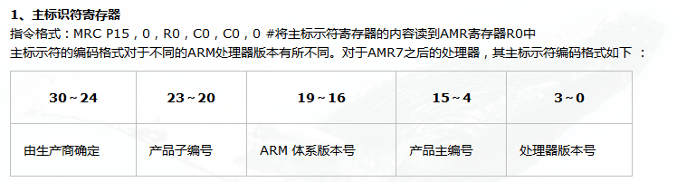
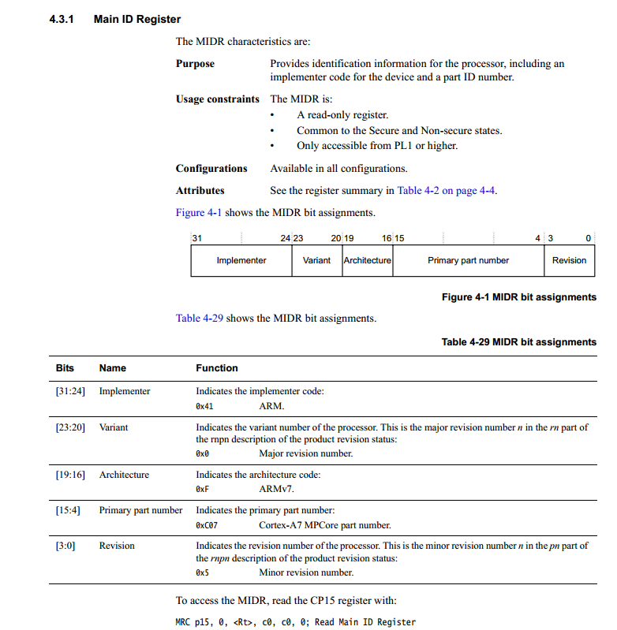
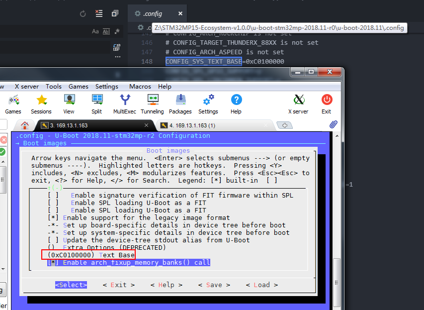
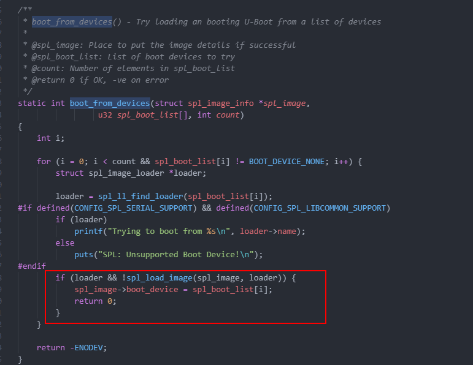

### 1.virtualization


```
	mrc	p15, 0, r0, c0, c1, 1		@ read ID_PFR1
	and	r0, r0, #CPUID_ARM_VIRT_MASK	@ mask virtualization bits
	cmp	r0, #(1 << CPUID_ARM_VIRT_SHIFT)
	beq	switch_to_hypervisor
```


```
#define CPUID_ARM_VIRT_SHIFT		12
#define CPUID_ARM_VIRT_MASK		(0xF << CPUID_ARM_VIRT_SHIFT)
```

这段代码应该是读取CP15 C0，判断支不支持虚拟化，





### lowlevel_inits.s 中：

```
	/*
	 * Setup a temporary stack. Global data is not available yet.
	 */
#if defined(CONFIG_SPL_BUILD) && defined(CONFIG_SPL_STACK)
	ldr	sp, =CONFIG_SPL_STACK
#else
	ldr	sp, =CONFIG_SYS_INIT_SP_ADDR
#endif
	bic	sp, sp, #7 /* 8-byte alignment for ABI compliance */
```


stm32mp1.h中

```
#define CONFIG_SPL_STACK		(STM32_SYSRAM_BASE + STM32_SYSRAM_SIZE)
```

stm32.h中

```
#define STM32_SYSRAM_BASE		0x2FFC0000
#define STM32_SYSRAM_SIZE		SZ_256K
```


SPL阶段把sp设置到内部SRAM


stm32mp1.h中

```
#define CONFIG_SYS_INIT_SP_ADDR			CONFIG_SYS_TEXT_BASE
```

CONFIG_SYS_TEXT_BASE是在config中定义




从这可以看出uboot SPL 阶段SP指针设置到内部SRAM，第二阶段放到外部DRAM


##### 设置**global data**：

```
	/*
	 * Set up global data for boards that still need it. This will be
	 * removed soon.
	 */
#ifdef CONFIG_SPL_BUILD
	ldr	r9, =gdata
#else
	sub	sp, sp, #GD_SIZE
	bic	sp, sp, #7
	mov	r9, sp
#endif
```


u-boot-2018.11\include\generated\generic-asm-offsets.h：

```
#define GD_SIZE 216 /* sizeof(struct global_data)	@ */
```


lowlevel_init中就做两件事：

1. 设置sp
2. 设置global data


##### u-boot-2018.11\arch\arm\lib\crt0.S：

```
#if defined(CONFIG_SPL_BUILD) && defined(CONFIG_SPL_STACK)
	ldr	r0, =(CONFIG_SPL_STACK)
#else
	ldr	r0, =(CONFIG_SYS_INIT_SP_ADDR)
#endif
	bic	r0, r0, #7	/* 8-byte alignment for ABI compliance */
	mov	sp, r0
	bl	board_init_f_alloc_reserve
	mov	sp, r0
	/* set up gd here, outside any C code */
	mov	r9, r0
	bl	board_init_f_init_reserve

	mov	r0, #0
	bl	board_init_f
```


**SPL**阶段中**board_init_f**在**u-boot-2018.11\arch\arm\mach-stm32mp\spl.c**：

```
void board_init_f(ulong dummy)
{
	struct udevice *dev;
	int ret;

	arch_cpu_init();

	ret = spl_early_init();
	
	if (ret) {
		debug("spl_early_init() failed: %d\n", ret);
		hang();
	}

	ret = uclass_get_device(UCLASS_CLK, 0, &dev);
	if (ret) {
		debug("Clock init failed: %d\n", ret);
		return;
	}

	ret = uclass_get_device(UCLASS_RESET, 0, &dev);
	if (ret) {
		debug("Reset init failed: %d\n", ret);
		return;
	}

	ret = uclass_get_device(UCLASS_PINCTRL, 0, &dev);
	if (ret) {
		debug("%s: Cannot find pinctrl device\n", __func__);
		return;
	}

	/* enable console uart printing */
	 preloader_console_init();

	ret = uclass_get_device(UCLASS_RAM, 0, &dev);
	if (ret) {
		printf("DRAM init failed: %d\n", ret);
		hang();
	}
}
```


> ​	ret = spl_early_init();

里面有进行设备树的操作


**u-boot-2018.11\arch\arm\lib\crt0.S**中**_main**调用的**board_init_r**在（通过串口输出信息看到）：

> u-boot-2018.11\common\spl\spl.c


```
void board_init_r(gd_t *dummy1, ulong dummy2)
{
	u32 spl_boot_list[] = {
		BOOT_DEVICE_NONE,
		BOOT_DEVICE_NONE,
		BOOT_DEVICE_NONE,
		BOOT_DEVICE_NONE,
		BOOT_DEVICE_NONE,
	};
	struct spl_image_info spl_image;

	debug(">>spl:board_init_r()\n");
	printf("spl:board_init_r\n");
	spl_set_bd();

#ifdef CONFIG_SPL_OS_BOOT
	dram_init_banksize();
#endif

#if defined(CONFIG_SYS_SPL_MALLOC_START)
	mem_malloc_init(CONFIG_SYS_SPL_MALLOC_START,
			CONFIG_SYS_SPL_MALLOC_SIZE);
	gd->flags |= GD_FLG_FULL_MALLOC_INIT;
#endif
	if (!(gd->flags & GD_FLG_SPL_INIT)) {
		if (spl_init())
			hang();
	}
#if !defined(CONFIG_PPC) && !defined(CONFIG_ARCH_MX6)
	/*
	 * timer_init() does not exist on PPC systems. The timer is initialized
	 * and enabled (decrementer) in interrupt_init() here.
	 */
	timer_init();
#endif

#if CONFIG_IS_ENABLED(BOARD_INIT)
	spl_board_init();
#endif

	bootcount_inc();

	memset(&spl_image, '\0', sizeof(spl_image));
#ifdef CONFIG_SYS_SPL_ARGS_ADDR
	spl_image.arg = (void *)CONFIG_SYS_SPL_ARGS_ADDR;
#endif
	spl_image.boot_device = BOOT_DEVICE_NONE;
	board_boot_order(spl_boot_list);

	if (boot_from_devices(&spl_image, spl_boot_list,
			      ARRAY_SIZE(spl_boot_list))) {
		puts("SPL: failed to boot from all boot devices\n");
		hang();
	}

	spl_perform_fixups(&spl_image);

#ifdef CONFIG_CPU_V7M
	spl_image.entry_point |= 0x1;
#endif
	switch (spl_image.os) {
	case IH_OS_U_BOOT:
		debug("Jumping to U-Boot\n");
		break;
#if CONFIG_IS_ENABLED(ATF)
	case IH_OS_ARM_TRUSTED_FIRMWARE:
		debug("Jumping to U-Boot via ARM Trusted Firmware\n");
		spl_invoke_atf(&spl_image);
		break;
#endif
#if CONFIG_IS_ENABLED(OPTEE)
	case IH_OS_TEE:
		debug("Jumping to U-Boot via OP-TEE\n");
		spl_optee_entry(NULL, NULL, spl_image.fdt_addr,
				(void *)spl_image.entry_point);
		break;
#endif
#ifdef CONFIG_SPL_OS_BOOT
	case IH_OS_LINUX:
		debug("Jumping to Linux\n");
		spl_fixup_fdt();
		spl_board_prepare_for_linux();
		jump_to_image_linux(&spl_image);
#endif
	default:
		debug("Unsupported OS image.. Jumping nevertheless..\n");
	}
#if CONFIG_VAL(SYS_MALLOC_F_LEN) && !defined(CONFIG_SYS_SPL_MALLOC_SIZE)
	debug("SPL malloc() used 0x%lx bytes (%ld KB)\n", gd->malloc_ptr,
	      gd->malloc_ptr / 1024);
#endif
#ifdef CONFIG_BOOTSTAGE_STASH
	int ret;

	bootstage_mark_name(BOOTSTAGE_ID_END_SPL, "end_spl");
	ret = bootstage_stash((void *)CONFIG_BOOTSTAGE_STASH_ADDR,
			      CONFIG_BOOTSTAGE_STASH_SIZE);
	if (ret)
		debug("Failed to stash bootstage: err=%d\n", ret);
#endif

	debug("loaded - jumping to U-Boot...\n");
	spl_board_prepare_for_boot();
	jump_to_image_no_args(&spl_image);
}
```


##### spl部分


文件**Zu-boot-2018.11\common\spl\spl.c**中



拷贝第二阶段在**spl_load_image**实现，之前的都是在初始化环境，判断是从哪里启动

```
static int spl_load_image(struct spl_image_info *spl_image,
			  struct spl_image_loader *loader)
{
	struct spl_boot_device bootdev;

	bootdev.boot_device = loader->boot_device;
	bootdev.boot_device_name = NULL;

	return loader->load_image(spl_image, &bootdev);
}
```

这段代码的调试信息：

```
Trying to boot from MMC1
uclass_find_device_by_seq: 0 0
   - 0 -1 'sdmmc@58005000'
   - not found
uclass_find_device_by_seq: 1 0
   - 0 -1 'sdmmc@58005000'
   - found
uclass_find_device_by_seq: 0 0
   - 0 -1 'sdmmc@58005000'
   - not found
uclass_find_device_by_seq: 0 0
   - 0 0 'pin-controller@50002000'
   - found
stm32_pinctrl_set_state_simple: periph->name = sdmmc@58005000
fdtdec_get_int_array_count: pinmux
stm32_pinctrl_config: no of pinmux entries= 5
stm32_pinctrl_config: pinmux = 280d
prep_gpio_dsc: GPIO:port= 2, pin= 8
fdtdec_get_int: slew-rate: 0x1 (1)
fdtdec_get_bool: drive-open-drain
fdtdec_get_bool: bias-pull-up
fdtdec_get_bool: bias-pull-down
prep_gpio_ctl: gpio fn= 13, slew-rate= 1, op type= 0, pull-upd is = 0
uclass_find_device_by_seq: 0 2
   - 0 -1 'gpio@50002000'
   - 1 1 'gpio@50003000'
   - 2 -1 'gpio@50004000'
   - 3 -1 'gpio@50005000'
   - 4 -1 'gpio@50006000'
   - 5 -1 'gpio@50007000'
   - 6 6 'gpio@50008000'
   - 7 -1 'gpio@50009000'
   - 8 -1 'gpio@5000a000'
   - 25 25 'gpio@54004000'
   - not found
uclass_find_device_by_seq: 1 2
   - 0 -1 'gpio@50002000'
   - 1 1 'gpio@50003000'
   - 2 -1 'gpio@50004000'
   - found
uclass_find_device_by_seq: 0 2
   - 0 -1 'gpio@50002000'
   - 1 1 'gpio@50003000'
   - 2 -1 'gpio@50004000'
   - 3 -1 'gpio@50005000'
   - 4 -1 'gpio@50006000'
   - 5 -1 'gpio@50007000'
   - 6 6 'gpio@50008000'
   - 7 -1 'gpio@50009000'
   - 8 -1 'gpio@5000a000'
   - 25 25 'gpio@54004000'
   - not found
uclass_find_device_by_seq: 0 0
   - 0 0 'pin-controller@50002000'
   - found
OF: ** translation for device gpio@50004000 **
OF: bus is default (na=1, ns=1) on pin-controller@50002000
OF: translating address: 00200000
OF: parent bus is default (na=1, ns=1) on soc
OF: walking ranges...
OF: default map, cp=0, s=41984, da=8192
OF: parent translation for: 00200050
OF: with offset: 8192
OF: one level translation: 00400050
OF: parent bus is default (na=1, ns=1) on
OF: no ranges, 1:1 translation
OF: parent translation for: 00000000
OF: with offset: 1342193664
OF: one level translation: 00400050
OF: reached root node
ofnode_read_string: st,bank-name: GPIOC
addr = 0x50004000 bank_name = GPIOC gpio_count = 16 gpio_range = 0xffff
clk_get_by_indexed_prop(dev=2fffd848, index=0, clk=2fffcb84)
fdtdec_get_int: #clock-cells: 0x1 (1)
clk_of_xlate_default(clk=2fffcb84)
clk_request(dev=2fffd250, clk=2fffcb84)
clk_enable(clk=2fffcb84)
stm32mp1_clk_enable: id clock 86 has been enabled
clock enabled for device gpio@50004000
stm32_pinctrl_config: rv = 0

stm32_pinctrl_config: pinmux = 290d
prep_gpio_dsc: GPIO:port= 2, pin= 9
fdtdec_get_int: slew-rate: 0x1 (1)
fdtdec_get_bool: drive-open-drain
fdtdec_get_bool: bias-pull-up
fdtdec_get_bool: bias-pull-down
prep_gpio_ctl: gpio fn= 13, slew-rate= 1, op type= 0, pull-upd is = 0
uclass_find_device_by_seq: 0 2
   - 0 -1 'gpio@50002000'
   - 1 1 'gpio@50003000'
   - 2 2 'gpio@50004000'
   - found
stm32_pinctrl_config: rv = 0

stm32_pinctrl_config: pinmux = 2a0d
prep_gpio_dsc: GPIO:port= 2, pin= 10
fdtdec_get_int: slew-rate: 0x1 (1)
fdtdec_get_bool: drive-open-drain
fdtdec_get_bool: bias-pull-up
fdtdec_get_bool: bias-pull-down
prep_gpio_ctl: gpio fn= 13, slew-rate= 1, op type= 0, pull-upd is = 0
uclass_find_device_by_seq: 0 2
   - 0 -1 'gpio@50002000'
   - 1 1 'gpio@50003000'
   - 2 2 'gpio@50004000'
   - found
stm32_pinctrl_config: rv = 0

stm32_pinctrl_config: pinmux = 2b0d
prep_gpio_dsc: GPIO:port= 2, pin= 11
fdtdec_get_int: slew-rate: 0x1 (1)
fdtdec_get_bool: drive-open-drain
fdtdec_get_bool: bias-pull-up
fdtdec_get_bool: bias-pull-down
prep_gpio_ctl: gpio fn= 13, slew-rate= 1, op type= 0, pull-upd is = 0
uclass_find_device_by_seq: 0 2
   - 0 -1 'gpio@50002000'
   - 1 1 'gpio@50003000'
   - 2 2 'gpio@50004000'
   - found
stm32_pinctrl_config: rv = 0

stm32_pinctrl_config: pinmux = 320d
prep_gpio_dsc: GPIO:port= 3, pin= 2
fdtdec_get_int: slew-rate: 0x1 (1)
fdtdec_get_bool: drive-open-drain
fdtdec_get_bool: bias-pull-up
fdtdec_get_bool: bias-pull-down
prep_gpio_ctl: gpio fn= 13, slew-rate= 1, op type= 0, pull-upd is = 0
uclass_find_device_by_seq: 0 3
   - 0 -1 'gpio@50002000'
   - 1 1 'gpio@50003000'
   - 2 2 'gpio@50004000'
   - 3 -1 'gpio@50005000'
   - 4 -1 'gpio@50006000'
   - 5 -1 'gpio@50007000'
   - 6 6 'gpio@50008000'
   - 7 -1 'gpio@50009000'
   - 8 -1 'gpio@5000a000'
   - 25 25 'gpio@54004000'
   - not found
uclass_find_device_by_seq: 1 3
   - 0 -1 'gpio@50002000'
   - 1 1 'gpio@50003000'
   - 2 2 'gpio@50004000'
   - 3 -1 'gpio@50005000'
   - found
uclass_find_device_by_seq: 0 3
   - 0 -1 'gpio@50002000'
   - 1 1 'gpio@50003000'
   - 2 2 'gpio@50004000'
   - 3 -1 'gpio@50005000'
   - 4 -1 'gpio@50006000'
   - 5 -1 'gpio@50007000'
   - 6 6 'gpio@50008000'
   - 7 -1 'gpio@50009000'
   - 8 -1 'gpio@5000a000'
   - 25 25 'gpio@54004000'
   - not found
uclass_find_device_by_seq: 0 0
   - 0 0 'pin-controller@50002000'
   - found
OF: ** translation for device gpio@50005000 **
OF: bus is default (na=1, ns=1) on pin-controller@50002000
OF: translating address: 00300000
OF: parent bus is default (na=1, ns=1) on soc
OF: walking ranges...
OF: default map, cp=0, s=41984, da=12288
OF: parent translation for: 00200050
OF: with offset: 12288
OF: one level translation: 00500050
OF: parent bus is default (na=1, ns=1) on
OF: no ranges, 1:1 translation
OF: parent translation for: 00000000
OF: with offset: 1342197760
OF: one level translation: 00500050
OF: reached root node
ofnode_read_string: st,bank-name: GPIOD
addr = 0x50005000 bank_name = GPIOD gpio_count = 16 gpio_range = 0xffff
clk_get_by_indexed_prop(dev=2fffd89c, index=0, clk=2fffcb84)
fdtdec_get_int: #clock-cells: 0x1 (1)
clk_of_xlate_default(clk=2fffcb84)
clk_request(dev=2fffd250, clk=2fffcb84)
clk_enable(clk=2fffcb84)
stm32mp1_clk_enable: id clock 87 has been enabled
clock enabled for device gpio@50005000
stm32_pinctrl_config: rv = 0

fdtdec_get_int_array_count: pinmux
stm32_pinctrl_config: no of pinmux entries= 1
stm32_pinctrl_config: pinmux = 2c0d
prep_gpio_dsc: GPIO:port= 2, pin= 12
fdtdec_get_int: slew-rate: 0x2 (2)
fdtdec_get_bool: drive-open-drain
fdtdec_get_bool: bias-pull-up
fdtdec_get_bool: bias-pull-down
prep_gpio_ctl: gpio fn= 13, slew-rate= 2, op type= 0, pull-upd is = 0
uclass_find_device_by_seq: 0 2
   - 0 -1 'gpio@50002000'
   - 1 1 'gpio@50003000'
   - 2 2 'gpio@50004000'
   - found
stm32_pinctrl_config: rv = 0

OF: ** translation for device sdmmc@58005000 **
OF: bus is default (na=1, ns=1) on soc
OF: translating address: 00500058
OF: parent bus is default (na=1, ns=1) on
OF: no ranges, 1:1 translation
OF: parent translation for: 00000000
OF: with offset: 1476415488
OF: one level translation: 00500058
OF: reached root node
ofnode_read_bool: st,neg-edge: true
ofnode_read_bool: st,sig-dir: false
ofnode_read_bool: st,use-ckin: false
clk_get_by_indexed_prop(dev=2fffd394, index=0, clk=c030000c)
fdtdec_get_int: #clock-cells: 0x1 (1)
clk_of_xlate_default(clk=c030000c)
clk_request(dev=2fffd250, clk=c030000c)
clk_enable(clk=c030000c)
stm32mp1_clk_enable: id clock 118 has been enabled
reset_get_by_index(dev=2fffd394, index=0, reset_ctl=c0300018)
fdtdec_get_int: #reset-cells: 0x1 (1)
reset_of_xlate_default(reset_ctl=c0300018)
gpio_request_tail: Node 'sdmmc@58005000', property 'cd-gpios', failed to request GPIO index 0: -2
ofnode_read_u32: max-frequency: 0x7270e00 (120000000)
ofnode_read_u32: bus-width: 0x4 (4)
reset_assert(reset_ctl=c0300018)
stm32_reset_assert: reset id = 3280 bank = 408 offset = 16)
reset_deassert(reset_ctl=c0300018)
stm32_reset_deassert: reset id = 3280 bank = 408 offset = 16)
uclass_find_device_by_seq: 0 1
   - 0 0 'sdmmc@58005000'
   - not found
uclass_find_device_by_seq: 1 1
   - 0 0 'sdmmc@58005000'
   - not found
stm32_sdmmc2_getcd called
clock is disabled (0Hz)
clk_get_rate(clk=c030000c)
stm32mp1_clk_get_parent: PLL4_P clock is the parent SDMMC12 of clk id 118
stm32mp1_clk_get(19) clock = 5e69ec0 : 99000 kHz
stm32mp1_clk_get_rate: computed rate for id clock 118 is 99000000 (parent is PLL4_P)
stm32_sdmmc2_set_ios: bus_with = 0, clock = 0
reset_assert(reset_ctl=c0300018)
stm32_reset_assert: reset id = 3280 bank = 408 offset = 16)
reset_deassert(reset_ctl=c0300018)
stm32_reset_deassert: reset id = 3280 bank = 408 offset = 16)
selecting mode MMC legacy (freq : 0 MHz)
clk_get_rate(clk=c030000c)
stm32mp1_clk_get_parent: PLL4_P clock is the parent SDMMC12 of clk id 118
stm32mp1_clk_get(19) clock = 5e69ec0 : 99000 kHz
stm32mp1_clk_get_rate: computed rate for id clock 118 is 99000000 (parent is PLL4_P)
stm32_sdmmc2_set_ios: bus_with = 1, clock = 0
clock is enabled (400000Hz)
clk_get_rate(clk=c030000c)
stm32mp1_clk_get_parent: PLL4_P clock is the parent SDMMC12 of clk id 118
stm32mp1_clk_get(19) clock = 5e69ec0 : 99000 kHz
stm32mp1_clk_get_rate: computed rate for id clock 118 is 99000000 (parent is PLL4_P)
stm32_sdmmc2_set_ios: bus_with = 1, clock = 400000
stm32_sdmmc2_send_cmd: send cmd 0 data: 0x0 @ 0x0
stm32_sdmmc2_send_cmd: end for CMD 0, ret = 0
stm32_sdmmc2_send_cmd: send cmd 8 data: 0x0 @ 0x0
stm32_sdmmc2_send_cmd: end for CMD 8, ret = 0
stm32_sdmmc2_send_cmd: send cmd 55 data: 0x0 @ 0x0
stm32_sdmmc2_send_cmd: end for CMD 55, ret = 0
stm32_sdmmc2_send_cmd: send cmd 41 data: 0x0 @ 0x0
stm32_sdmmc2_send_cmd: end for CMD 41, ret = 0
stm32_sdmmc2_send_cmd: send cmd 55 data: 0x0 @ 0x0
stm32_sdmmc2_send_cmd: end for CMD 55, ret = 0
stm32_sdmmc2_send_cmd: send cmd 41 data: 0x0 @ 0x0
stm32_sdmmc2_send_cmd: end for CMD 41, ret = 0
stm32_sdmmc2_send_cmd: send cmd 2 data: 0x0 @ 0x0
stm32_sdmmc2_send_cmd: end for CMD 2, ret = 0
stm32_sdmmc2_send_cmd: send cmd 3 data: 0x0 @ 0x0
stm32_sdmmc2_send_cmd: end for CMD 3, ret = 0
stm32_sdmmc2_send_cmd: send cmd 9 data: 0x0 @ 0x0
stm32_sdmmc2_send_cmd: end for CMD 9, ret = 0
selecting mode MMC legacy (freq : 25 MHz)
stm32_sdmmc2_send_cmd: send cmd 7 data: 0x0 @ 0x0
stm32_sdmmc2_send_cmd: end for CMD 7, ret = 0
stm32_sdmmc2_send_cmd: send cmd 55 data: 0x0 @ 0x0
stm32_sdmmc2_send_cmd: end for CMD 55, ret = 0
stm32_sdmmc2_send_cmd: send cmd 51 data: 0x8 @ 0x2fffcc64
stm32_sdmmc2_send_cmd: end for CMD 51, ret = 0
stm32_sdmmc2_send_cmd: send cmd 6 data: 0x40 @ 0x2fffcc74
stm32_sdmmc2_send_cmd: end for CMD 6, ret = 0
sd card: widths [4, 1] modes [SD Legacy, SD High Speed (50MHz)]
host: widths [4, 1] modes [MMC legacy, SD Legacy, MMC High Speed (26MHz), SD High Speed (50MHz), MMC High Speed (52MHz)]
trying mode SD High Speed (50MHz) width 4 (at 50 MHz)
stm32_sdmmc2_send_cmd: send cmd 55 data: 0x0 @ 0x0
stm32_sdmmc2_send_cmd: end for CMD 55, ret = 0
stm32_sdmmc2_send_cmd: send cmd 6 data: 0x0 @ 0x0
stm32_sdmmc2_send_cmd: end for CMD 6, ret = 0
clk_get_rate(clk=c030000c)
stm32mp1_clk_get_parent: PLL4_P clock is the parent SDMMC12 of clk id 118
stm32mp1_clk_get(19) clock = 5e69ec0 : 99000 kHz
stm32mp1_clk_get_rate: computed rate for id clock 118 is 99000000 (parent is PLL4_P)
stm32_sdmmc2_set_ios: bus_with = 4, clock = 400000
stm32_sdmmc2_send_cmd: send cmd 6 data: 0x40 @ 0x2fffccbc
stm32_sdmmc2_send_cmd: end for CMD 6, ret = 0
selecting mode SD High Speed (50MHz) (freq : 50 MHz)
clock is enabled (50000000Hz)
clk_get_rate(clk=c030000c)
stm32mp1_clk_get_parent: PLL4_P clock is the parent SDMMC12 of clk id 118
stm32mp1_clk_get(19) clock = 5e69ec0 : 99000 kHz
stm32mp1_clk_get_rate: computed rate for id clock 118 is 99000000 (parent is PLL4_P)
stm32_sdmmc2_set_ios: bus_with = 4, clock = 50000000
blk_find_device: if_type=6, devnum=0: sdmmc@58005000.blk, 6, 0
stm32_sdmmc2_send_cmd: send cmd 16 data: 0x0 @ 0x0
stm32_sdmmc2_send_cmd: end for CMD 16, ret = 0
stm32_sdmmc2_send_cmd: send cmd 17 data: 0x200 @ 0x2fffc98c
stm32_sdmmc2_send_cmd: end for CMD 17, ret = 0
part_init: try 'EFI': ret=0
spl: mmc boot mode: raw
blk_find_device: if_type=6, devnum=0: sdmmc@58005000.blk, 6, 0
stm32_sdmmc2_send_cmd: send cmd 16 data: 0x0 @ 0x0
stm32_sdmmc2_send_cmd: end for CMD 16, ret = 0
stm32_sdmmc2_send_cmd: send cmd 17 data: 0x200 @ 0x2fffc8c4
stm32_sdmmc2_send_cmd: end for CMD 17, ret = 0
blk_find_device: if_type=6, devnum=0: sdmmc@58005000.blk, 6, 0
stm32_sdmmc2_send_cmd: send cmd 16 data: 0x0 @ 0x0
stm32_sdmmc2_send_cmd: end for CMD 16, ret = 0
stm32_sdmmc2_send_cmd: send cmd 17 data: 0x200 @ 0x2fffc8c4
stm32_sdmmc2_send_cmd: end for CMD 17, ret = 0
GPT: first_usable_lba: 22 last_usable_lba: 1DACBDE last lba: 1dacc00
alloc_read_gpt_entries: count = 128 * 128 = 16384
blk_find_device: if_type=6, devnum=0: sdmmc@58005000.blk, 6, 0
stm32_sdmmc2_send_cmd: send cmd 16 data: 0x0 @ 0x0
stm32_sdmmc2_send_cmd: end for CMD 16, ret = 0
stm32_sdmmc2_send_cmd: send cmd 18 data: 0x4000 @ 0x2fffc8c4
stm32_sdmmc2_send_cmd: end for CMD 18, ret = 0
stm32_sdmmc2_send_cmd: send cmd 12 data: 0x0 @ 0x0
stm32_sdmmc2_send_cmd: end for CMD 12, ret = 0
part_get_info_efi: start 0x422, size 0x1000, name ssbl
blk_find_device: if_type=6, devnum=0: sdmmc@58005000.blk, 6, 0
stm32_sdmmc2_send_cmd: send cmd 16 data: 0x0 @ 0x0
stm32_sdmmc2_send_cmd: end for CMD 16, ret = 0
stm32_sdmmc2_send_cmd: send cmd 17 data: 0x200 @ 0x2fffcdc4
stm32_sdmmc2_send_cmd: end for CMD 17, ret = 0
hdr read sector 422, count=1
spl: payload image: U-Boot 2018.11-stm32mp-r2 for st▒ load addr: 0xc00fffc0 size: 867480
blk_find_device: if_type=6, devnum=0: sdmmc@58005000.blk, 6, 0
stm32_sdmmc2_send_cmd: send cmd 16 data: 0x0 @ 0x0
stm32_sdmmc2_send_cmd: end for CMD 16, ret = 0
stm32_sdmmc2_send_cmd: send cmd 18 data: 0xd3e00 @ 0x2fffcdc4
stm32_sdmmc2_send_cmd: end for CMD 18, ret = 0
stm32_sdmmc2_send_cmd: send cmd 12 data: 0x0 @ 0x0
stm32_sdmmc2_send_cmd: end for CMD 12, ret = 0
read 69f sectors to c00fffc0
```

