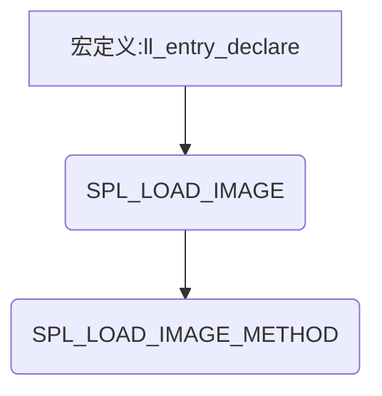

<h3>Index</h3>
* <a href="#ll_entry_declare">ll_entry_declare</a>
* <a href="#SPL_LOAD_IMAGE">SPL_LOAD_IMAGE</a>
* <a href="#SPL_LOAD_IMAGE_METHOD">SPL_LOAD_IMAGE_METHOD</a>


在文件**u-boot-2018.11\common\spl\spl.c**中有这么一个函数：

```
static struct spl_image_loader *spl_ll_find_loader(uint boot_device)
{
	struct spl_image_loader *drv =
		ll_entry_start(struct spl_image_loader, spl_image_loader);
	const int n_ents =
		ll_entry_count(struct spl_image_loader, spl_image_loader);
	struct spl_image_loader *entry;

	for (entry = drv; entry != drv + n_ents; entry++) {
		if (boot_device == entry->boot_device)
			return entry;
	}

	/* Not found */
	return NULL;
}
```

这个函数的作用是根据所选择的启动方法（板子上的硬件决定），找到执行拷贝uboot第二阶段程序的程序的入口，其中结构体**spl_image_loader**为；

```
/**
 * Holds information about a way of loading an SPL image
 *
 * @name: User-friendly name for this method (e.g. "MMC")
 * @boot_device: Boot device that this loader supports
 * @load_image: Function to call to load image
 */
struct spl_image_loader {
#ifdef CONFIG_SPL_LIBCOMMON_SUPPORT
	const char *name;
#endif
	uint boot_device;
	/**
	 * load_image() - Load an SPL image
	 *
	 * @spl_image: place to put image information
	 * @bootdev: describes the boot device to load from
	 */
	int (*load_image)(struct spl_image_info *spl_image,
			  struct spl_boot_device *bootdev);
};
```


<h3 id="SPL_LOAD_IMAGE_METHOD">
    SPL_LOAD_IMAGE_METHOD
</h3>

在文件**u-boot-2018.11\common\spl\spl_mmc.c**底部有这么几行代码：

```
SPL_LOAD_IMAGE_METHOD("MMC1", 0, BOOT_DEVICE_MMC1, spl_mmc_load_image);
SPL_LOAD_IMAGE_METHOD("MMC2", 0, BOOT_DEVICE_MMC2, spl_mmc_load_image);
SPL_LOAD_IMAGE_METHOD("MMC2_2", 0, BOOT_DEVICE_MMC2_2, spl_mmc_load_image);
```

宏**SPL_LOAD_IMAGE_METHOD**为：

```
/*
 * _priority is the priority of this method, 0 meaning it will be the top
 * choice for this device, 9 meaning it is the bottom choice.
 * _boot_device is the BOOT_DEVICE_... value
 * _method is the load_image function to call
 */
#ifdef CONFIG_SPL_LIBCOMMON_SUPPORT
#define SPL_LOAD_IMAGE_METHOD(_name, _priority, _boot_device, _method) \
	SPL_LOAD_IMAGE(_method ## _priority ## _boot_device) = { \
		.name = _name, \
		.boot_device = _boot_device, \
		.load_image = _method, \
	}
#else
#define SPL_LOAD_IMAGE_METHOD(_name, _priority, _boot_device, _method) \
	SPL_LOAD_IMAGE(_method ## _priority ## _boot_device) = { \
		.boot_device = _boot_device, \
		.load_image = _method, \
	}
#endif
```


<h4 id="SPL_LOAD_IMAGE">SPL_LOAD_IMAGE</h4>

```
/* Declare an SPL image loader */
#define SPL_LOAD_IMAGE(__name)					\
	ll_entry_declare(struct spl_image_loader, __name, spl_image_loader)
```


<h4 id="ll_entry_declare">
    ll_entry_declare
</h4>

```
/**
 * ll_entry_declare() - Declare linker-generated array entry
 * @_type:	Data type of the entry
 * @_name:	Name of the entry
 * @_list:	name of the list. Should contain only characters allowed
 *		in a C variable name!
 *
 * This macro declares a variable that is placed into a linker-generated
 * array. This is a basic building block for more advanced use of linker-
 * generated arrays. The user is expected to build their own macro wrapper
 * around this one.
 *
 * A variable declared using this macro must be compile-time initialized.
 *
 * Special precaution must be made when using this macro:
 *
 * 1) The _type must not contain the "static" keyword, otherwise the
 *    entry is generated and can be iterated but is listed in the map
 *    file and cannot be retrieved by name.
 *
 * 2) In case a section is declared that contains some array elements AND
 *    a subsection of this section is declared and contains some elements,
 *    it is imperative that the elements are of the same type.
 *
 * 3) In case an outer section is declared that contains some array elements
 *    AND an inner subsection of this section is declared and contains some
 *    elements, then when traversing the outer section, even the elements of
 *    the inner sections are present in the array.
 *
 * Example:
 *
 * ::
 *
 *   ll_entry_declare(struct my_sub_cmd, my_sub_cmd, cmd_sub) = {
 *           .x = 3,
 *           .y = 4,
 *   };
 */
#define ll_entry_declare(_type, _name, _list)				\
	_type _u_boot_list_2_##_list##_2_##_name __aligned(4)		\
			__attribute__((unused,				\
			section(".u_boot_list_2_"#_list"_2_"#_name)))
```





