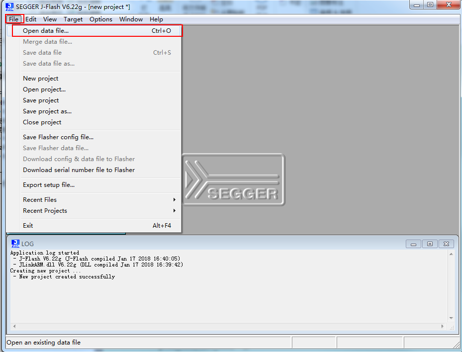

#### 1.打开**J-Flash**，

* 从开始菜单中打开**J-Flash**,如下图：

* 打开后界面如下：

* 把对话框(**Welcome to J-Flash**)关掉，关掉之后界面如下：

#### 2、选择MCU

* 从菜单栏中选择**Project setting**,如下图：

  

打开后如下：

* 选择MCU选项，打开MCU选择对话框：

  

* 打开MCU选择对话框后如下：

  

选择所需型号，然后点击OK，如下：

#### 3、设置下载接口为**SWD**

在Project setting对话框中选择**Target Interface**，并选择接口为SWD，然后点击确认键，如下图：

#### 4、选择固件

* 从菜单栏中File选项选择**Open data file**，如下：

  

* 选择所需下载固件，并打开：

#### 5、下载固件

MCU型号选择好了，下载接口选择了，固件打开了后，就可以下载固件了，可以用**F7**键下载，也可以从J-Flash菜单栏中**Target**菜单的**Production Programing**下载，如下：

