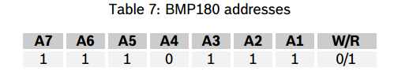
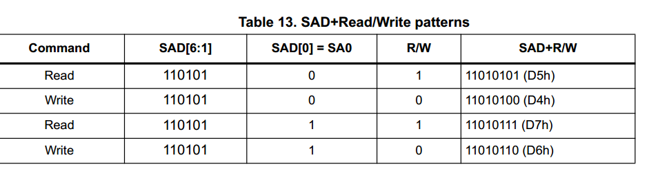

最近用到了STM32的I2C，由于是很久之前用过的，看了下以前的代码，用的是下面一个函数：
```
/**
  * @brief  Read an amount of data in blocking mode from a specific memory address
  * @param  hi2c Pointer to a I2C_HandleTypeDef structure that contains
  *                the configuration information for the specified I2C.
  * @param  DevAddress Target device address: The device 7 bits address value
  *         in datasheet must be shift at right before call interface
  * @param  MemAddress Internal memory address
  * @param  MemAddSize Size of internal memory address
  * @param  pData Pointer to data buffer
  * @param  Size Amount of data to be sent
  * @param  Timeout Timeout duration
  * @retval HAL status
  */
HAL_StatusTypeDef HAL_I2C_Mem_Read(I2C_HandleTypeDef *hi2c, uint16_t DevAddress, uint16_t MemAddress, uint16_t MemAddSize, uint8_t *pData, uint16_t Size, uint32_t Timeout)
```


#### Read BMP180 ID:
BMP180 add:



ID register:

| register add | value |
| ------------ | ----- |
| 0xd0         | 0x55  |

```
void read_bmp180_id(void)
{
  uint8_t er=0,id=0;
  er = HAL_I2C_Mem_Read(&hi2c1,0xee, 0xd0,1, &id, 1, 1000);
}
```

#### read lsm6dsl id
lsm6dsl add:




```
void lsm6dsl_read_id(void)
{
	uint8_t id=0,err = 0;
	err = HAL_I2C_Mem_Read(&hi2c2, 0x6a<<1, 0x0f, 1, &id, 1,1000);
	printf("Thd id is:%x,err is:%x\r\n",id,err);
}
```