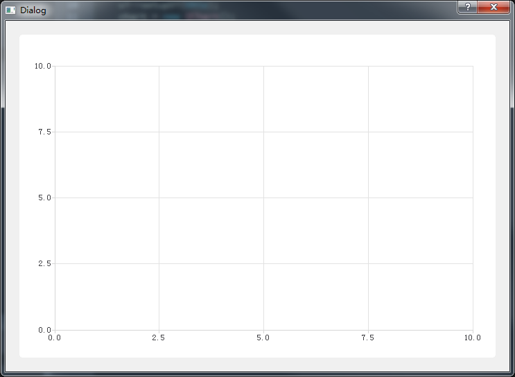
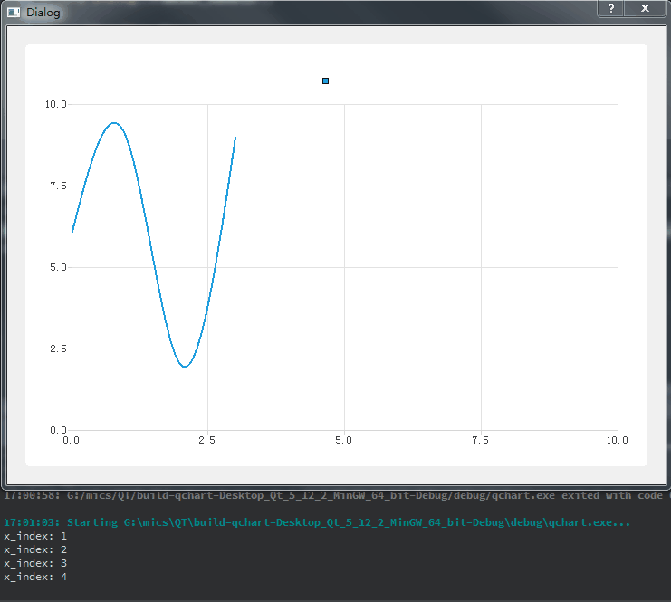
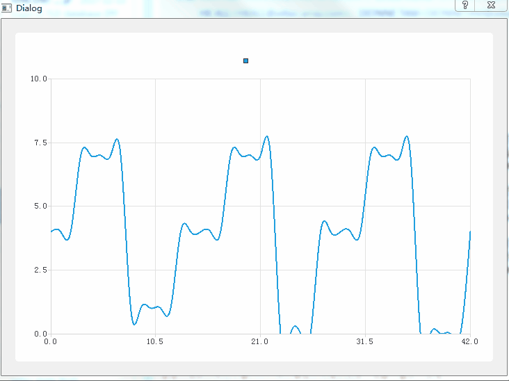
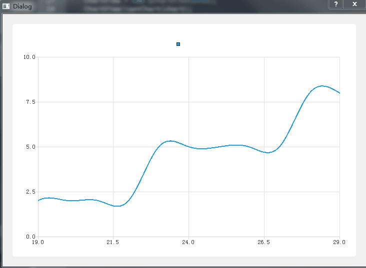

## 1、添加坐标轴
按照之前的一篇文章([overview](overview.md)),先在工程中添加QChart、QChartView，代码如下：
```
Dialog::Dialog(QWidget *parent) :
    QDialog(parent),
    ui(new Ui::Dialog)
{
    ui->setupUi(this);
    chart = new QChart();
    ChartView = new QChartView(this);
    ChartView->setChart(chart);
    ui->verticalLayout->addWidget(ChartView);
}
```

然后定义两个坐标轴，一个用作X轴，一个用作Y轴，
添加头文件：
> #include <QtCharts/QValueAxis>

创建两个QValueAxis：
```
    QValueAxis *axisX;
    QValueAxis *axisY;
```

在构造函数中，对两个坐标轴进行实例化，把X轴范围设置为0-10并放置在坐标系的底部，Y轴范围设置为0-10并放置在坐标系的左边，并且添加到QChart中，如下：
```
Dialog::Dialog(QWidget *parent) :
    QDialog(parent),
    ui(new Ui::Dialog)
{
    ui->setupUi(this);
    chart = new QChart();

    axisX = new QValueAxis();
    axisY = new QValueAxis();

    chart->addAxis(axisX,Qt::AlignBottom);
    chart->addAxis(axisY,Qt::AlignLeft);

    axisX->setTickCount(5);
    axisX->setRange(0, 10);
    axisY->setRange(0, 10);

    ChartView = new QChartView(this);
    ChartView->setChart(chart);
    ui->verticalLayout->addWidget(ChartView);
}
```
编译运行，结果如下：



从上图可以看出，成功创建了一个笛卡尔坐标系。


## 2、使用定时器动态添加数据
这里尝试下使用曲线图，创建一个曲线序列，

   * 添加头文件
 >        #include <QtCharts/QSplineSeries>
   * 在类声明中添加：
 >        QSplineSeries *series;
   * 在构造函数中对series进行实例化，并跟之前创建的坐标轴关联起来：
 ```
    series = new QSplineSeries(this);
    series->attachAxis(axisX);
    series->attachAxis(axisY);
```

然后添加定时器：
```

Dialog::Dialog(QWidget *parent) :
    QDialog(parent),
    ui(new Ui::Dialog)
{
    .....
    QTimer timer;
    connect(&timer, &QTimer::timeout, this, &Chart::Timeout_handler);
    timer.setInterval(1000);
}

void Dialog::Timeout_handler()
{

}
```
首先定义一个整形变量x_index，初始化为0，用来给series序列中的x赋值，定时器每触发一个事件，使用随机数生成函数生成的值给series序列中的y赋值,然后x_index的值加一,主要代码如下：
```
void Dialog::Timeout_handler()
{
    QDateTime dt;
    QString current_dt = dt.currentDateTime().toString("yyyy:MM:dd:hh:mm:ss:zzz");
    qsrand(dt.currentDateTime().toTime_t());
    int y = qrand() % 10;
    series->append(x_index,y);
    x_index ++;
    qDebug()<<"x_index:"<<x_index;
}
```
运行结果如下：



从上图中可以看到曲线是动起来了，可是当x_index大于10的时候，曲线就没有动了，也就是时序列series第10个及后面数据都没有显示出来，

## 3、实现实时曲线
因为之前X轴范围为0-10，能显示的数据也就只有x值在0-10范围内，超过10的就无法显示，那如果要显示实时更新的数据，该怎么操作呢？
*   一个方法是当序列series中的数据增加时，X轴范围也增加，代码如下：
```
void Dialog::Timeout_handler()
{
    QDateTime dt;
    QString current_dt = dt.currentDateTime().toString("yyyy:MM:dd:hh:mm:ss:zzz");
    qsrand(dt.currentDateTime().toTime_t());
    int y = qrand() % 10;
    series->append(x_index,y);

    if(x_index > 10)
        axisX->setRange(0, x_index);
    x_index ++;
}
```
当x_index超过10后，没增加一个，就把x轴显示范围设置为0-x_inxex,显示效果如下：



* 还是改变x轴的，不过，可现实区域是固定的
```
void Dialog::Timeout_handler()
{
    QDateTime dt;
    QString current_dt = dt.currentDateTime().toString("yyyy:MM:dd:hh:mm:ss:zzz");
    qsrand(dt.currentDateTime().toTime_t());
    int y = qrand() % 10;
    series->append(x_index,y);

    if(x_index > 10)
        axisX->setRange(x_index-10, x_index);
    x_index ++;
}
```

