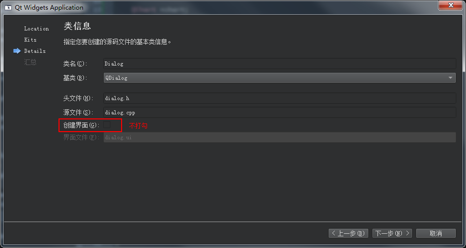
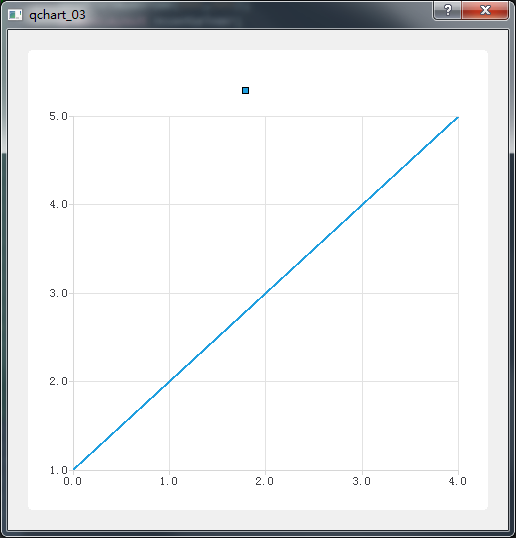

新建一个**Qt Widgets Application**项目，不添加UI文件，如下图：

​	


建立工程后，在**.pro**文件中添加：

> QT += charts

然后在**.h**文件中添加：

```
#include "QChart"

using namespace QtCharts;
```


在**.cpp**中，先添加一些用到的头文件，把窗口最小值设置为500X500，添加一个QVBoxLayout，代码如下：

```
#include "dialog.h"
#include "QVBoxLayout"
#include "QChart"
#include "QChartView"
#include "QSplineSeries"

Dialog::Dialog(QWidget *parent)
    : QDialog(parent)
{
    setMinimumSize(500,500);
    QVBoxLayout *container;
    this->setLayout(container);
}
```


然后声明变量：

```
    QChart *chart;
    QChartView *ChartView;
    QSplineSeries *series;
```

分别声明了一个QchartView、QChart、QSplineSeries对象。

然后给series添加数值，这里添加5个点，

```
    series->append(0,1);
    series->append(1,2);
    series->append(2,3);
    series->append(3,4);
    series->append(4,5);
```


最后把series添加到QChart，把QChart添加到ChartView，再把ChartView添加到layout中，最后代码如下：

```
Dialog::Dialog(QWidget *parent)
    : QDialog(parent)
{
    setMinimumSize(500,500);
    QVBoxLayout *container;

    QChart *chart;
    QChartView *ChartView;
    QSplineSeries *series;

    series = new QSplineSeries(this);
    chart = new QChart();

    series->append(0,1);
    series->append(1,2);
    series->append(2,3);
    series->append(3,4);
    series->append(4,5);

    chart->addSeries(series);
    chart->createDefaultAxes();
    ChartView = new QChartView(this);
    ChartView->setChart(chart);

    container = new QVBoxLayout();
    container->addWidget(ChartView);

    this->setLayout(container);
}
```


编译运行结果如下：


​	