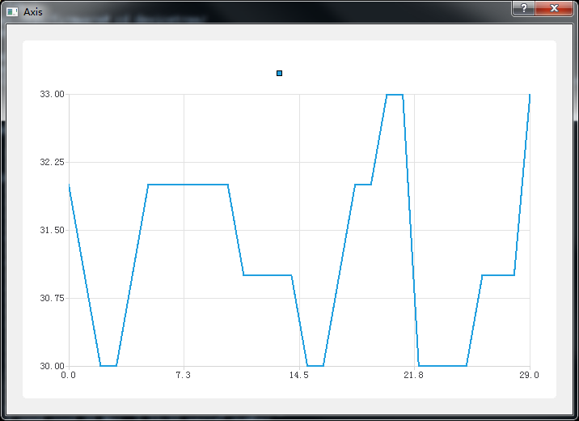
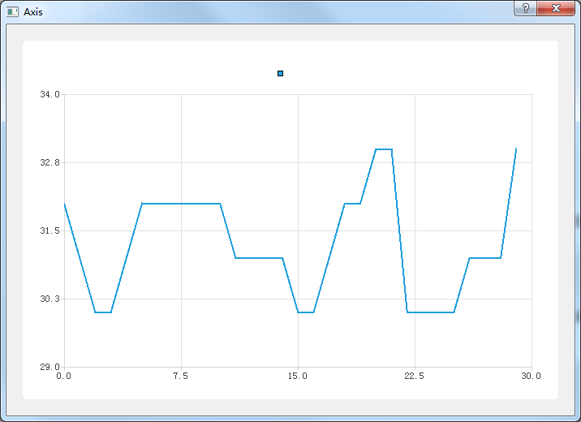

这次来学学Qt chart 的坐标轴

有这么一组数据：


这是深圳市2019年6月份的天气预报（来自中国天气网：[深圳](http://www.weather.com.cn/weather40d/101280601.shtml)），里面有每天的最高温度，把这最高温度做成个数组，如下：

```
int daily_temp_max[30] = [32,
        31,30,30,31,32,32,32,
        32,32,32,31,31,31,31,
        30,30,31,32,32,33,33,
        30,30,30,30,31,31,31,
        33];

```

按照之前的笔记，建立一个可以用Qt Chart的工程，并把上面的数据用折线图显示出来，代码如下：

```C++
Dialog::Dialog(QWidget *parent) :
    QDialog(parent),
    ui(new Ui::Dialog)
{
    ui->setupUi(this);

    int daily_temp_max[30] = {32,
            31,30,30,31,32,32,32,
            32,32,32,31,31,31,31,
            30,30,31,32,32,33,33,
            30,30,30,30,31,31,31,
            33};

    QLineSeries* temp_max_series = new QLineSeries();

    for(int i=0;i<30;i++)
        temp_max_series->append(i,daily_temp_max[i]);

    chart = new QChart();
    chart->addSeries(temp_max_series);

    ChartView = new QChartView(this);
    ChartView->setChart(chart);
    ui->containfer->addWidget(ChartView);
}
```

显示结果为：


上图中只能看想到一条折线，此外看不出任何信息，不知道这个图标表示的是什么数据，数据范围是什么，

现在来给图表加上坐标轴，让图表表示的数据有意义

##### 1. 使用QChart API 添加默认的坐标轴

QChart类有个API：

> void QChart::createDefaultAxes()

可以根据QChart中已有的图表穿件坐标轴，把在程序中调用该函数，代码为：

```
Dialog::Dialog(QWidget *parent) :
    QDialog(parent),
    ui(new Ui::Dialog)
{
    ui->setupUi(this);
    int daily_temp_max[30] = {32,
            31,30,30,31,32,32,32,
            32,32,32,31,31,31,31,
            30,30,31,32,32,33,33,
            30,30,30,30,31,31,31,
            33};

    QLineSeries* temp_max_series = new QLineSeries();

    for(int i=0;i<30;i++)
        temp_max_series->append(i,daily_temp_max[i]);

    chart = new QChart();
    chart->addSeries(temp_max_series);

    chart->createDefaultAxes();
    ChartView = new QChartView(this);
    ChartView->setChart(chart);
    ui->verticalLayout->addWidget(ChartView);
}
```

显示结果为：




##### 2. 手动添加坐标轴

首先使用**QValueAxis**来创建坐标轴，如下:

```
 Dialog::Dialog(QWidget *parent) :
    QDialog(parent),
    ui(new Ui::Dialog)
{
    ui->setupUi(this);
    int daily_temp_max[30] = {32,
            31,30,30,31,32,32,32,
            32,32,32,31,31,31,31,
            30,30,31,32,32,33,33,
            30,30,30,30,31,31,31,
            33};

    QLineSeries* temp_max_series = new QLineSeries();

    for(int i=0;i<30;i++)
        temp_max_series->append(i,daily_temp_max[i]);


    chart = new QChart();
    chart->addSeries(temp_max_series);
    
    axisX = new QValueAxis();
    axisY = new QValueAxis();
    chart->addAxis(axisX,Qt::AlignBottom);
    chart->addAxis(axisY,Qt::AlignLeft);
    axisX->setRange(0, 30);
    axisY->setRange(28, 35);

    temp_max_series->attachAxis(axisX);
    temp_max_series->attachAxis(axisY);


    ChartView = new QChartView(this);
    ChartView->setChart(chart);
    ui->verticalLayout->addWidget(ChartView);
}
```

上面代码中：

```
    axisX = new QValueAxis();
    axisY = new QValueAxis();
```

是用来创建坐标轴的，这里创建2个坐标轴，然后把X轴添加到图表的底部，Y轴添加到图表的左边：

```
    chart->addAxis(axisX,Qt::AlignBottom);
    chart->addAxis(axisY,Qt::AlignLeft);
```

然后设置坐标轴的范围，由于有30个数据，所以把X轴设置为0-30，要显示的数据最大值为33，最小值为30，这里把Y轴设置为29-34，然后跟temp_max_series关联起来：

```
    axisX->setRange(0, 30);
    axisY->setRange(29, 34);

    temp_max_series->attachAxis(axisX);
    temp_max_series->attachAxis(axisY);
```


最后显示结果如下：



