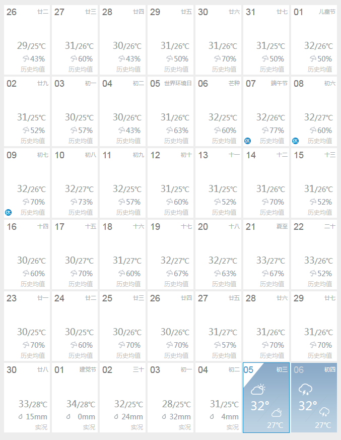

这次来学学Qt chart 的坐标轴

有这么一组数据：



这是深圳市2019年6月份的天气预报（来自中国天气网：[深圳](http://www.weather.com.cn/weather40d/101280601.shtml)），里面有每天的最高问题，我把组数据做成两个数组：

```
int daily_temp_max[30] = [32,
        31,30,30,31,32,32,32,
        32,32,32,31,31,31,31,
        30,30,31,32,32,33,33,
        30,30,30,30,31,31,31,
        33];
int daily_temp_min[30] = [26,
        25,25,26,26,25,26,27,
        26,27,25,25,25,26,26,
        26,27,27,27,27,27,26,
        25,25,26,26,27,26,26
        28];
```

按照之前的笔记，建立一个可以用Qt Chart的工程，并把上面的数据用折线图显示出来，代码如下：

```C++

```

