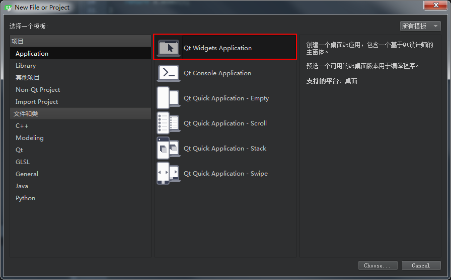
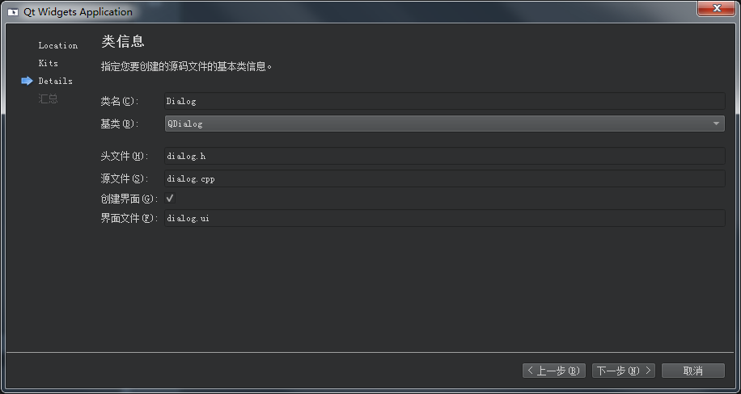
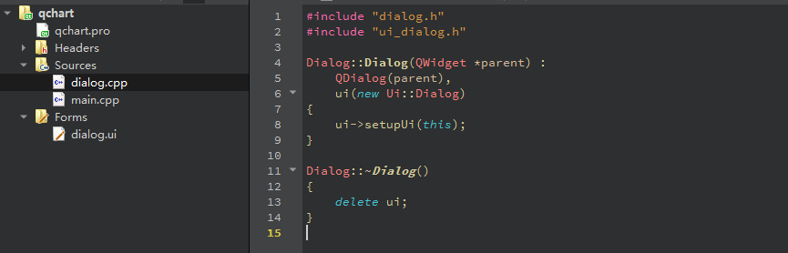
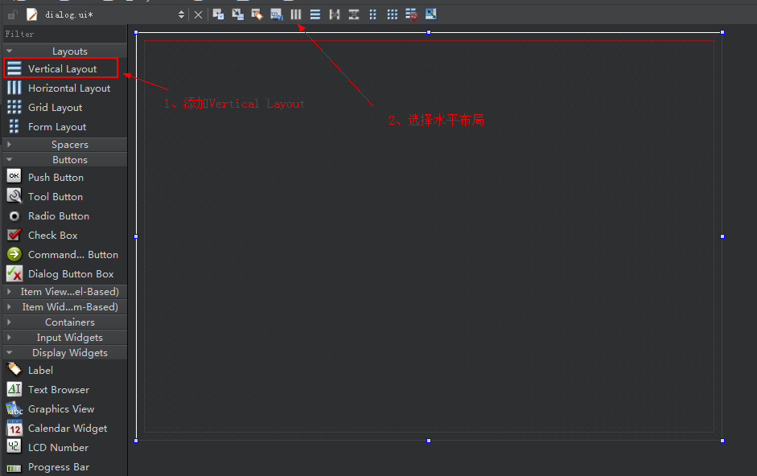
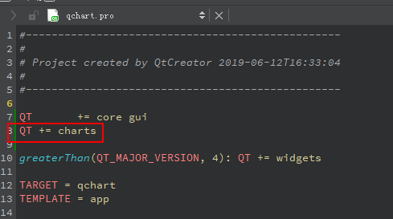
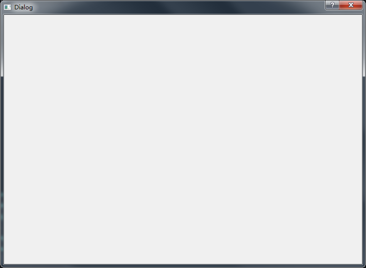
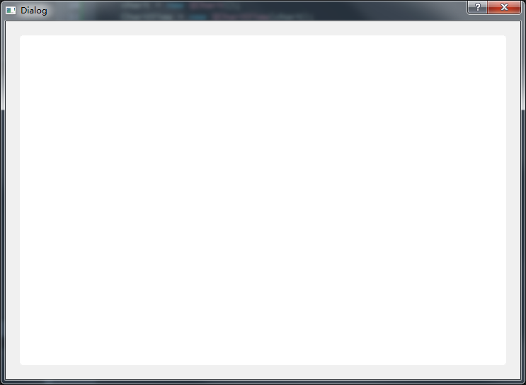

1、创建一个Qt Widgets Application工程，如下图：



给工程命名为**qchart**,


做一个比较简单的，选择基类为QDialog:



建成后的项目如下：




2、编辑UI文件
打开**dialog.ui**,添加**Vertical Layout**,然后选择水平布局，如下图：



3、添加chart库
* 编辑pro文件：
  


* 在 **.h**声明命名空间(这里在dialog.h中添加)
  
```
using namespace QtCharts;
```
或者
```
QT_CHARTS_USE_NAMESPACE
```

编译运行，如果没有错误，运行结果如下：



4、添加QChartView                     
由于Qt Charts是基于Qt Graphics View实现的，要在UI应用中添加图表功能，首先需要个QGraphicsView，Qt Charts提供了QChartView，首先我们再这里添加QChartView:
* 在头文件diloag.h中包含如下头文件
```
#include <QChartView>
```
* 然后再类定义中添加变量：
```
class Dialog : public QDialog
{
    Q_OBJECT

public:
    explicit Dialog(QWidget *parent = nullptr);
    ~Dialog();

private:
    Ui::Dialog *ui;

    QChartView *ChartView;
};
```
其中
```
    QChartView *ChartView;
```
是新添加的，

* 在Dialog构造函数中添加代码：
```
Dialog::Dialog(QWidget *parent) :
    QDialog(parent),
    ui(new Ui::Dialog)
{
    ui->setupUi(this);


    ChartView = new QChartView(this);
    ui->verticalLayout->addWidget(ChartView);
}
```

运行结果如下：



上图中，与之前的执行结果相比，多了个白色区域，说明QChartView添加成功，因为我们还没有添加任何图标所以是空白的，

5、实现图表
QChartView成功添加了后，就可以在上面实现图表了，这里尝试下实现直线图，
这里还要介绍一个类-QChart，QChart管理图表中的数据（或者说级数，也就是要在图标中显示的数据）、坐标轴、图例等，也就是说，
要实现的图表，都需要通过QChart实现，
还有QAbstractSeries，QAbstractSeries是Qt Charts中表示图表的各个类的基类，
