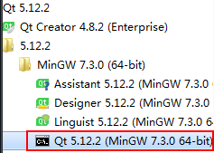
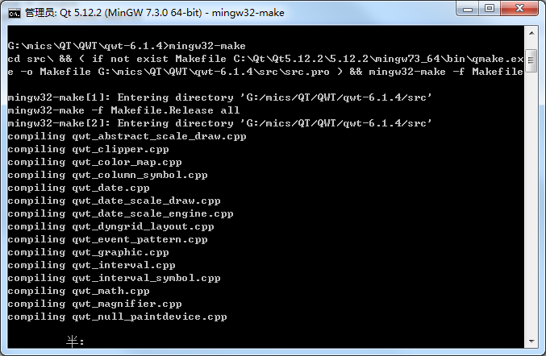
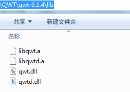

1、下载连接：
> [https://sourceforge.net/projects/qwt/files/qwt/](https://sourceforge.net/projects/qwt/files/qwt/)

2、编译
* 命令行编译
  打开QT命令行工具，如下图，并进入QWT源码所在目录

  

  依次输入如下命令开始编译：
>  qmake qwt.pro              
> mingw32-make

* 使用QTCreater编译
使用QTCreater打开**qwt.pro**，然后编译即可，

* 编译完之后，QWT源码所在目录下会生成**lib**文件夹，里面是编译生成的文件，如下图：

qwt_designer_plugin.dll：               
    Qt\Qt5.12.2\Tools\QtCreator\bin\plugins\designer --> QT Creater                               
    Qt\Qt5.12.2\5.12.2\mingw73_64\plugins\designer  --> Designer 5.12.2 (MinGW 7.3.0 64-bit)

qwt.dll 和 qwtd.dll :
    D:\Qt\Qt5.9.2\5.9.2\mingw53_32\bin

libqwt.a、libqwtd.a
    D:\Qt\Qt5.9.2\5.9.2\mingw53_32\lib