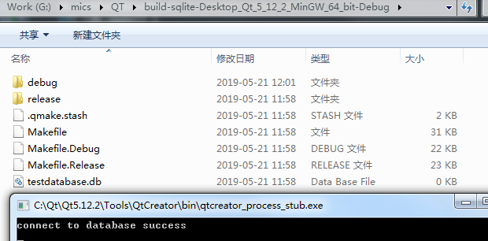
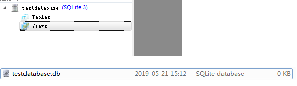
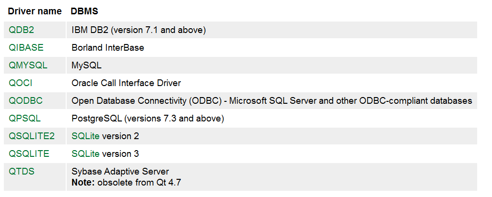

创建一个QT Console Application
1、pro文件中添加sql:
> QT += sql

2、包含相关头文件：
```
#include "QtSql/QSqlDatabase"
#include "QtSql/QSqlError"
#include "QtSql/QSqlQuery"
```
3、添加sqlite操作相关代码
```
    QSqlDatabase db = QSqlDatabase::addDatabase( "QSQLITE" );
    db.setDatabaseName( "./testdatabase.db" );
    if( !db.open() )
    {
      qDebug() << db.lastError();
      qFatal( "Failed to connect." );
    }
    qDebug()<<"connect to database success";
```
执行结果如下：




执行到open()时，如果这个数据库不存在，则会自动创建；如果已经存在，则后续的操作会在已有的数据库上进行。用sqlitestudio打开文件**testdatabase.db**如下：



可以看到该数据库里面什么都没有。

4、创建table

```
    QSqlQuery sql_query;
    QString create_table = "create table randdata (time varchar(30), rand int)";
    sql_query.prepare(create_table);
    if(!sql_query.exec())
    {
        qDebug() << "Error: Fail to create table." << sql_query.lastError();
    }
    else
    {
        qDebug() << "Table created!";
    }
```
这里创建一个名为**randdata**的表格，实验结果第一次执行改程序成功，执行的调试信息跟sqlitestudio打开数据库后看到的结果如下：


从sqlitestudio可以看到创建的表格，一共两行，名称分别为：time、rand。

再运行一次，虽然可以成功打开并连接到数据库，但是创建表格失败了，应该同一个数据库不能重新创建table，


那如果运行改程序的时候，不知道数据库存不存在，不存在的话运行的时候肯定需要创建表格，还有，就算数据库存在，表格不一定存在，那每次运行都要尝试创建表格或者判断表格存不存在，不存在的话，就创建表格，程序可以改为：

```
    QSqlQuery sql_query;
    QString create_table = "create table if not exists randdata (time varchar(30), rand int)";
    // QString create_table = "create table randdata (time varchar(30), rand int)";
    sql_query.prepare(create_table);
    if(!sql_query.exec())
    {
        qDebug() << "Error: Fail to create table." << sql_query.lastError();
    }
    else
    {
        qDebug() << "Table created!";
    }
```


然后生成两个数据，一个是当前时间，然后另一个是随机数：

```

    QDateTime dt;
    QString current_dt = dt.currentDateTime().toString("yyyy:MM:dd:hh:mm:ss:zzz");
    
    qsrand(dt.currentDateTime().toTime_t());
    QString rand = QString::number(qrand());
```

最后写入数据库并把上述生成的数据打印出来：

```
    QString sql_insert = "insert into randdata values (";
    sql_insert.append("\"").append( current_dt + "\",").append(rand).append(")");
    sql_query.prepare(sql_insert);
    qDebug()<<current_dt<<","<<rand;
    if(!sql_query.exec())
    {
        qDebug() << sql_query.lastError();
    }
    else
    {
        qDebug() << "inserted Wang!";
    }
```

结果如下：


从上图中可以看到调试信息中的数据跟数据库中的数据一致，说明成功把数据保存到数据库中了

## note：

1. QT5.12中默认支持的数据库：



2、sqlite工具：

* [sqlitestudio](https://sqlitestudio.pl/index.rvt)

* [DB Browser for SQLite](<https://sqlitebrowser.org/>)

  