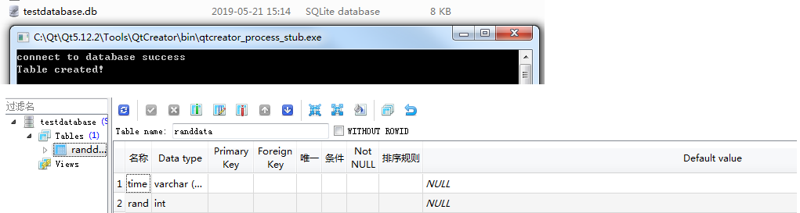

创建一个QT Console Application
1、pro文件中添加sql:
> QT += sql

2、包含相关头文件：
```
#include "QtSql/QSqlDatabase"
#include "QtSql/QSqlError"
#include "QtSql/QSqlQuery"
```
3、添加sqlite操作相关代码
```
    QSqlDatabase db = QSqlDatabase::addDatabase( "QSQLITE" );
    db.setDatabaseName( "./testdatabase.db" );
    if( !db.open() )
    {
      qDebug() << db.lastError();
      qFatal( "Failed to connect." );
    }
    qDebug()<<"connect to database success";
```
执行结果如下：


执行到open()时，如果这个数据库不存在，则会自动创建；如果已经存在，则后续的操作会在已有的数据库上进行。用打开文件**testdatabase.db**如下：


4、创建table
```
    QSqlQuery sql_query;
    QString create_table = "create table randdata (time varchar(30), rand int)";
    sql_query.prepare(create_table);
    if(!sql_query.exec())
    {
        qDebug() << "Error: Fail to create table." << sql_query.lastError();
    }
    else
    {
        qDebug() << "Table created!";
    }
```
这里创建一个名为**randdata**的表格，实验结果第一次执行改程序成功，执行的调试信息跟sqlitestudio打开数据库后看到的结果如下：



第二次就失败，应该同一个数据库不能重新创建table，


## note：
1. QT5.12中默认支持的数据库：


2、一个sqlite工具：[sqlitestudio](https://sqlitestudio.pl/index.rvt)

