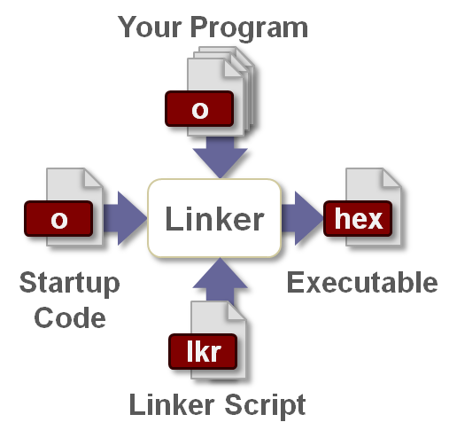

# 参考：
[The C Runtime Environment](https://microchipdeveloper.com/tls2101:c-runtime-environment)

We Are Not Alone

When you write your application in C, your code isn't the only thing that gets programmed into the PIC® microcontroller. Before your application can perform its first action, the C Runtime Environment startup code must configure the device to run code produced by a C compiler.

Purpose of the C Runtime Environment

There are several things the C Runtime Environment startup code must do before your application's code can run.

*  Allocate space for a software stack and initialize the stack pointer
    On 8-bit devices that have a hardware based return address stack, the software stack is mostly used for parameter passing to and from functions. On 16- and 32-bit devices the software stack also stores the return address for each function call and interrupt.
*  Allocate space for a heap (if used)
    A heap is a block of RAM that has been set aside as a sort of scratchpad for your application. C has the ability to dynamically create variables at runtime. This is done in the heap.
*  Copy values from Flash into variables declared with initial values
    Variables declared with initial values (e.g. int x=10;) must have those initial values loaded into memory before the program can use them. The initial values are stored in flash program memory (so they will be available after the device is power cycled) and are copied into each RAM location allocated to an initialized variable for its storage.
*   Clear uninitialized RAM
    Any RAM (file register) not allocated to a specific purpose (variable storage, stack, heap, etc.) is cleared so that it will be in a known state.
* Disable all interrupts
* Call main(), where your application code starts

Working With the C Runtime Environment

The runtime environment setup code is automatically linked into your application. It usually comes from a file with a name like crt0.s (assembly source) or crt0.o (object code).

The runtime startup code can be modified if necessary. In fact, the source file provides hooks for "user initialization" where you can run code that must execute before the main application begins, such as initializing some external hardware immediately after power is applied. Details on runtime startup code modification will be covered in the compiler specific classes.

用C语言写的单片机程序生成的固件并不是唯一的需要写进单片机的程序，在C程序运行之前，还需要一段代码对单片机进行初始化，完成C运行时环境，
需要初始化的有：