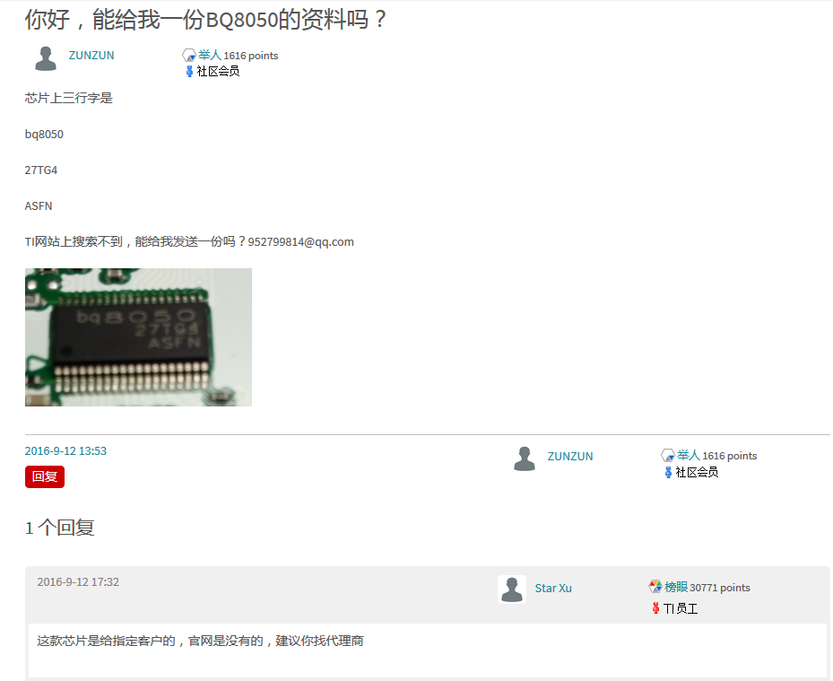

几年前(13年)买的戴尔笔记本电池用不了了，拆下来，一直放着，前几天收拾东西的时候，把电池给拆了，里面有3组18650电池，每一组是两个并联，一共有6个电池，

里面还有快点板，估计是充放电管理的吧，很明显看到一颗IC：**BQ8050**，

https://e2echina.ti.com/question_answer/analog/battery_management/f/35/t/116181

