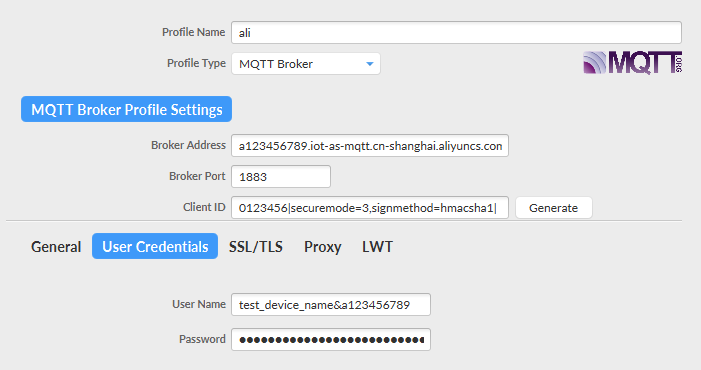

### 1、再创建完设备后，会弹出一个查看设备证书的界面如下：


假如复制出来是下面的值：
```
{
  "ProductKey": "a123456789",
  "DeviceName": "test_device_name",
  "DeviceSecret": "00112233445566778899"
}
```
### 2、如果是东二区（上海）Broker Address (格式：${YourProductKey}.iot-as-mqtt.${region}.aliyuncs.com)为：
> a123456789.iot-as-mqtt.cn-shanghai.aliyuncs.com

### 3、设备名字（格式：${YourDeviceName}&${YourPrductKey}）为：
>  test_device_name&a123456789
### 4、Client ID,假如把clientId设为：0123456，则Client ID 为：
>   0123456|securemode=3,signmethod=hmacsha1|
**注意：Client ID跟clientID是不一样的**
### 5、用阿里云提供的mqtt签名工具的设置为：


该工具下载链接：[mqtt签名工具](https://files.alicdn.com/tpsservice/88413c66e471bec826257781969d1bc7.zip?spm=a2c4g.11186623.2.21.460c9ff5NWycoH&file=88413c66e471bec826257781969d1bc7.zip)
### 6、用MQTT.fx测试，设置为：



### 7、QT中qtmqtt库使用如下：
```
    m_client = new QMqttClient(this);
    m_client->setHostname("a123456789.iot-as-mqtt.cn-shanghai.aliyuncs.com");
    m_client->setPort(1883);
    m_client->setPassword("8E78273A180CBA0E7E442626B6E1A3ED5C573C32");
    m_client->setUsername(" test_device_name&a123456789");
    m_client->setClientId("0123456|securemode=3,signmethod=hmacsha1|");
```

获取qtmqtt:
> git clone https://codereview.qt-project.org/qt/qtmqtt
## 参考
1、[使用MQTT.fx接入物联网平台](https://help.aliyun.com/document_detail/86706.html?spm=a2c4g.11174283.3.2.3a8b1668C91NVj)