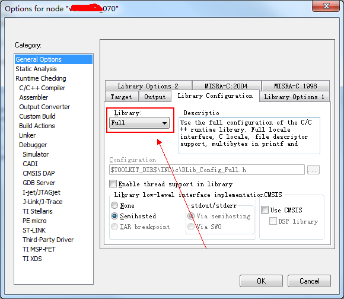

STM32CubeMX生成的工程，添加如下代码来实现printf功能，
```
int fputc(int ch, FILE *f) {  
    /* Do your stuff here */  
    /* Send your custom byte */  

    HAL_UART_Transmit(&huart2, (uint8_t*)&ch, 1, 10); // this is a blocking uart transmit function  
      
    /* If everything is OK, you have to return character written */  
    return ch;  
} 
```
出现如下错误：
>Error[Pe020]: identifier "FILE" is undefined 

解决办法:把General Options --> Library Configuration --> Library 改为**Full**,如下：


