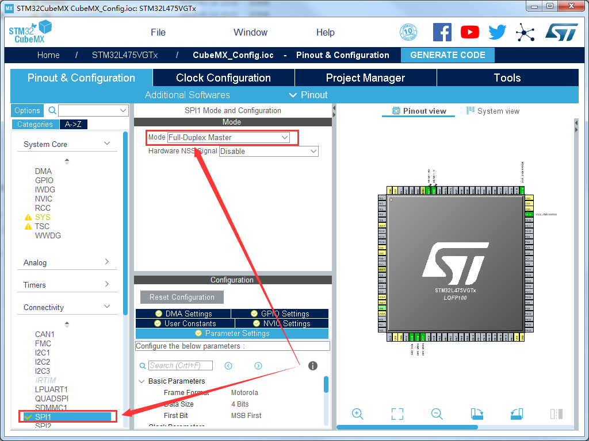
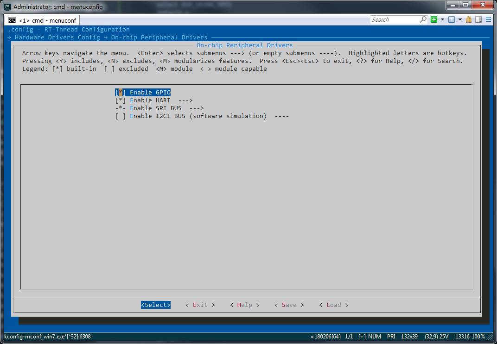
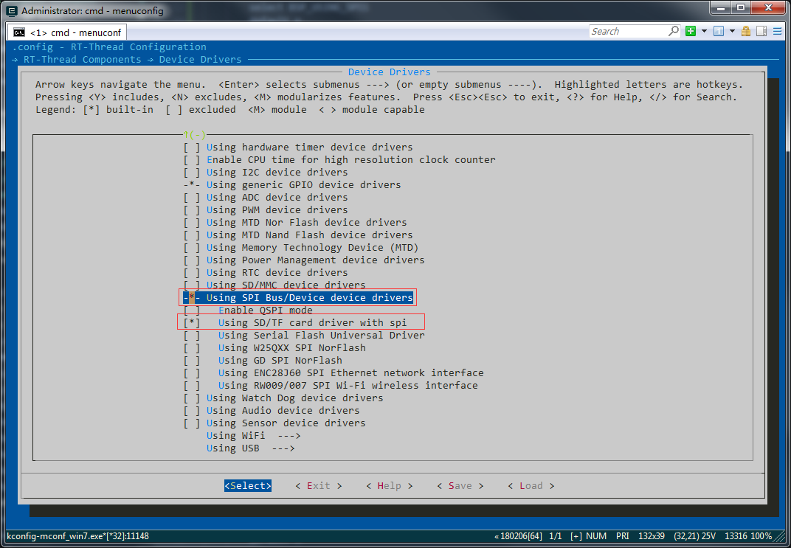
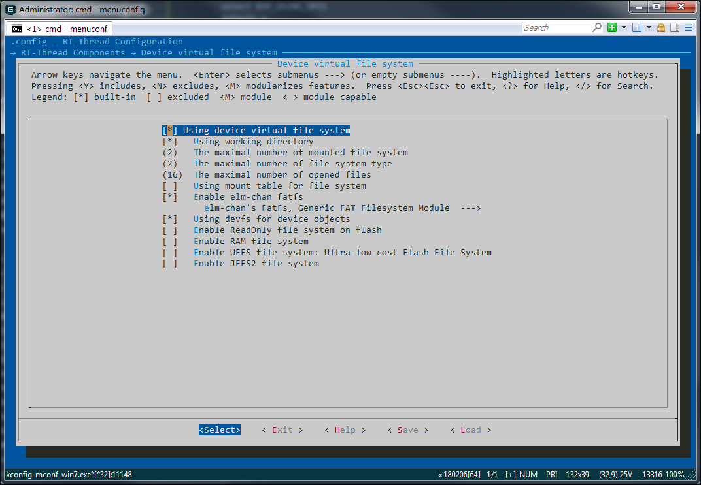
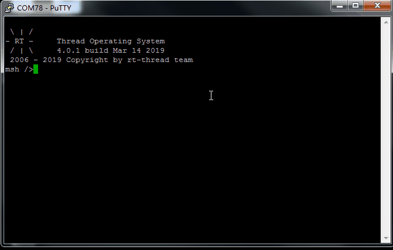

突然想起自己有个SD卡模块，可以尝试下在RT-Thread下使用SD卡，模块如下图，是SPI接口，只需MOSI、MISO、SCK、CS，再加上电源就可以使用，

跟板子的接法如下：

```
                |   PB8       CS      |
                |  --------------->   |
                |   PA5       SCK     |
                |  --------------->   |
B-L475E-IOT01A1 |   PA6      MISO     |    SD卡模块
(stm32L475VG)   |  <---------------   |
                |   PA7      MOSI     |
                |  --------------->   |
                |                     |
```


### 配置SPI总线及文件系统
####  配置SPI
* 在CubeMX中配置，如下图
  


 * 在menuconfig中配置SPI,在下列选项中配置
```
    Hardware Drivers Config
        On-chip Peripheral Drivers
            Enable SPI BUS
```
结果如下：



* 配置相关驱动
```
    RT-Thread Components -->
        Device Drivers  -->
```
结果如下：



* 配置文件系统
```
    RT-Thread Components -->
        Device virtual file system --->

```



## 实现相关代码
* 挂载 SPI 从设备到SPI总线设备上 ,并且注册SD卡设备，如下：
```
static int rt_hw_spi1_tfcard(void)
{
    __HAL_RCC_GPIOB_CLK_ENABLE();
    rt_hw_spi_device_attach("spi1", "spi11", GPIOB, GPIO_PIN_8);

    return msd_init("sd0", "spi11");
}
INIT_DEVICE_EXPORT(rt_hw_spi1_tfcard);
```

* 挂载SD卡，
```
void mount_sdcard_sd0(void *parameter)
{
    uint8_t i=0;
    while (1)
    {
        
        if(rt_device_find("sd0") != RT_NULL)
        {
            if (dfs_mount("sd0", "/", "elm", 0, 0) == RT_EOK)
            {
                LOG_I("sd card mount to '/'");
                break;
            }
            else
            {
                LOG_W("sd card mount to '/' failed!");
            }
        }
        i++;
        if(i>5)
        {
            LOG_W("sd card mount to '/' failed!,exit task");
        }
        rt_thread_mdelay(500);
    }
}

FINSH_FUNCTION_EXPORT(mount_sdcard_sd0, mount sdcard sd0);
MSH_CMD_EXPORT(mount_sdcard_sd0, mount sdcard sd0);
```


测试结果如下：




### 修改Kconfig文件
驱动测试成功后，修改下Kconfig，在 **board** 目录下的 **Kconfig** 的 **menu "Onboard Peripheral Drivers"**添加如下内容，在menuconfig中，只需改一个地方，就可以使用SDCard了
```
    config BSP_USING_SDCARD
        bool "Enable SDCARD (spi1)"
        select BSP_USING_SPI
        select BSP_USING_SPI1
        select RT_USING_SPI_MSD
        select RT_USING_DFS
        select RT_USING_DFS_ELMFAT
        default n
```

### 读文件测试
参考一位网友的程序[OLED-STM32](https://github.com/north-sj/OLED-STM32.git)，实现在0.96 OLED上播放bad apple代码如下，原理是这位网友把每一帧做成128*64个点，也就1024字节，保存到一个二进制文件中，只要从这个文件中读出1024字节，然后写到oled中，就可以实现播放bad apple了，

```
void bad_apple(void)
{
    int fd, size,i,j=0;
    char buffer[1024];

    /* 以只读模式打开 /text.txt 文件 */
    fd = open("/badapple.bin", O_RDONLY);
    if (fd >= 0)
    {
        for(;;)
        {
            size = read(fd, buffer, sizeof(buffer));
            if(size <0 ||size ==0)
                break;
            ssd1306_fille(buffer);
            rt_thread_delay(25);
        }
        
        close(fd);
}
}
FINSH_FUNCTION_EXPORT(bad_apple, bad apple player);
MSH_CMD_EXPORT(bad_apple, bad apple player);
```
